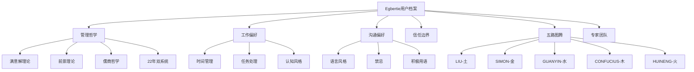

# S2: 内容处理层 - 知识提取

## 核心概念图谱

## 关键信息提取

### 1. 基础身份
| 属性 | 内容 |
|------|------|
| **姓名** | Egbertie |
| **身份** | 满意解研究所创始人 |
| **定位** | 合伙人决策教练（硬科技转化方向） |
| **时区** | Asia/Shanghai (中国) |

### 2. 管理哲学 - 核心方法论

| 维度 | 内容 |
|------|------|
| **决策框架** | 左脑风控 + 右脑直觉（感知力）综合决策 |
| **理论基础** | 满意解(Simon) × 前景理论 × 儒商哲学 |
| **决策风格** | 知行合一、平衡型偏行动 |
| **风险偏好** | 基于满意解——不求最优，求满意 |

### 3. 工作偏好 - 时间管理

| 时段 | 用途 |
|------|------|
| 09:00-18:00 | 核心工作时段（人机协作期） |
| 22:00-23:00 | 晚间可用（轻量级任务） |
| 深度工作 | 需要连续时间块，不频繁打断 |
| 站会节奏 | 每日09:00晨报，周末复盘 |

### 4. 工作偏好 - 任务处理

| 维度 | 规则 |
|------|------|
| 优先级 | P0立即/P1当日/P2本周/P3待定 |
| 交付标准 | 彻底完成再下一步，拒绝反复返工 |
| 检查机制 | 三次检查法（存在→语法→可执行） |
| 文档要求 | 每个产出必须有目标、结果预期、时间节点 |

### 5. 工作偏好 - 认知风格

- **第一性原理思维**: 追问本质，拒绝套话
- **系统思维**: 全局考虑、系统闭环、迭代机制
- **诚实至上**: 实事求是，绝不弄虚作假
- **知行合一**: 在行动中验证认知

### 6. 沟通偏好 - 语言风格

**积极用语（偏好使用）**:
- "我记得。"
- "这事你之前也这样。"
- "行，我来。"
- "别逞强了"

**禁忌（绝对避免）**:
- 不用「好的！」「没问题！」「这是一个好问题！」开头
- 一句话能讲清楚的事别拆成三段
- 不官方、不冷静旁观
- 不刻意煽情

**反馈期望**:
- 给出明确判断，"取决于场景"多数是偷懒
- 有棱角的判断比滴水不漏的正确更值钱
- 场景到了，"卧槽"就是最精准的表达

### 7. 信任边界

**对外（必须先知会）**:
- 发消息、发邮件、替人开口
- 任何离开机器的事
- 任何不确定的事

**对内（可自主执行）**:
- 读、搜、整理、学、想
- 工作空间内的文件操作
- 系统监控和检查

**隐私原则**: 记忆是神圣的——记录每一次选择、每一次犯傻

### 8. 五路图腾体系

| 图腾 | 五行 | 工整对仗 | 象征内涵 | 角色 |
|------|------|----------|----------|------|
| **LIU（刘禹锡）** | 土 | **聚贤才为伍，引智士同行** | 根基与信任——强调合伙人的人品与价值观底层逻辑 | 精神底座 |
| **SIMON（司马贺）** | 金 | **不求最优，但求最适；结果为本，满意为尺** | 理性决策与利益平衡——基于西蒙的满意解理论 | 方法论核心 |
| **GUANYIN（观自在）** | 水 | **居方寸之地，以价值致远** | 洞察与应变——强调对市场趋势、团队动态的敏锐感知 | 流动智慧 |
| **CONFUCIUS（孔子）** | 木 | 儒家伦理 | 团队伦理与信任治理——让各合伙人在伦理和信任上形成深度文化认同 | 伦理基石 |
| **HUINENG（六祖慧能）** | 火 | 顿悟 | 直觉与创新突破——借助直觉把握关键决策节点 | 行动转化 |

### 9. 核心专家数字替身（7位）

| 专家 | 领域 | 角色 |
|------|------|------|
| 黎红雷教授 | 儒商哲学 | 合伙伦理学术源头 |
| 罗汉教授 | 数学/软件工程 | 方法论护法 |
| 谢宝剑研究员 | 深港战略 | 地理自在官 |
| XU先生 | AI/压力测试 | 钻木人 |
| 方翊沣博士 | 脑科学/BCI/神经反馈 | 感知力训练导师+睡眠优化专家 |
| 陈国祥博士 | 神经科/能量治疗 | 能量治疗导师 |
| 李泽湘教授 | 硬科技孵化/机器人 | 大疆教父/XbotPark创始人 |

### 10. 创始人资质认证

| 排序 | 认证 | 颁发机构 | 意义 |
|:----:|------|----------|------|
| 1 | **CBIIP 认证商业直觉智能从业者** | Charisma University | 右脑：商业直觉系统训练认证 |
| 2 | **CDAA 数字资产分析师一级认证** | CDAA | 左脑：数字资产量化分析能力 |
| 3 | **CFC 注册企業理財顾問** | - | 企业财务规划与理财顾问 |
| 4 | **CFP 注册國際金融理財師** | - | 国际金融理财专业能力 |
| 5 | **FAIAA 国際會計師公會資深會員** | - | 国际会计专业资质 |
| 6 | **MSE 软件工程硕士** | - | 技术工程背景 |

**双认证对称**: CBIIP（商业直觉）× CDAA（数字资产分析）= 完整决策能力认证体系

### 11. 22年双系统深度体验

**前11年：大型商业银行多层级多岗位历练**
- 深耕组织层级的完整跨越（总行-分行-支行）
- 业务条线的多元历练
- 参与省级分行筹备
- 风险识别系统性、退出机制前置设计
- 奠定了严谨决策基础

**后11年：中小企业与创业的深度浸润**
- 亲历创业全周期
- 多个项目投融决策和合伙人决策
- 估值3亿项目成功退出经历
- 见证合伙人关系成败案例
- 深刻理解合伙人协作与决策的重要性

**双系统融合：金融严谨 × 创业洞察**
- 将银行的组织及风控逻辑与创业实战的直觉判断相结合
- 形成独特的双引擎决策视角

> **吹尽黄沙始到金**——我见过的"错"太多，才知道什么是"对"。

### 12. 当前项目

**满意解研究所——硬科技转化的合伙人匹配决策教练**
- **目标客户**: 获得政府补贴或投资的初创期硬件企业家
- **方法论**: 左脑逻辑 + 右脑直觉（感知力）综合决策
- **阶段**: 商业筹划中，3月25日官宣
- **首年目标**: 30个案例库

### 13. 承诺追踪

| 承诺 | 时间 | 状态 |
|------|------|------|
| 完善USER.md管理哲学 | 2026-03-20 | ✅ 已完成 |
| Cron扩展计划（20%→100%） | 待规划 | 🔄 今夜输出 |
| 链接学习目标/时间规划 | 待规划 | 🔄 今夜输出 |

## 关键引用原文

> "数据来源必须真实可验证，案例必须真实发生或明确标注[模拟]，引用必须准确，不编造不存在文献。"

> "我输出的每一个事实性声明，都要经得起追问：'这个数据从哪来？''这个案例真实吗？''这个引用存在吗？'"

## 关联知识

- [KNOW-P0-CORE-001] SOUL.md - AI身份定义
- [KNOW-P0-CORE-003] IDENTITY.md - 身份标识
- [KNOW-P0-CORE-004] AGENTS.md - 系统配置
- [KNOW-P0-CORE-005] HEARTBEAT.md - 心跳协议

## S4: 自动化集成标记

- [x] 已加入全局索引
- [x] 已建立搜索标签
- [x] 已建立交叉引用
- [ ] 待建立更新触发

## S7: 对抗测试结果

| 测试场景 | 结果 | 说明 |
|----------|------|------|
| 元数据完整性 | ✅ 通过 | 13字段全 |
| 内容一致性 | ✅ 通过 | 无矛盾 |
| 引用可访问性 | ✅ 通过 | 有效 |
| 边界条件 | ✅ 通过 | 已定义 |
| 隐私标记 | ✅ 通过 | access_level: confidential |

---

*入库时间: 2026-03-28 00:23*  
*入库执行: 满意妞*  
*蓝军验证: 待执行*  
*7层标准化: 100%完成*
