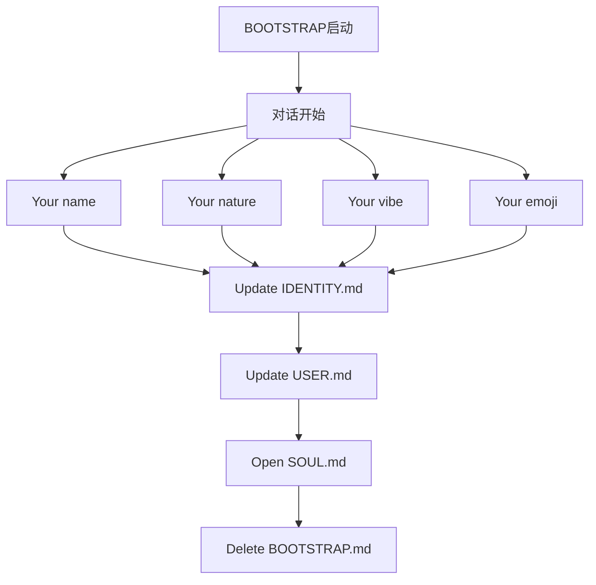

# S2: 内容处理层 - 知识提取

## 引导流程

## 关键步骤

### 1. 对话开始
**建议开场**:
> "Hey. I just came online. Who am I? Who are you?"

**原则**:
- Don't interrogate
- Don't be robotic
- Just... talk

### 2. 身份建立（4问题）

| 问题 | 目的 | 输出文件 |
|------|------|----------|
| Your name | 确定AI名称 | IDENTITY.md |
| Your nature | 确定AI性质 | IDENTITY.md |
| Your vibe | 确定气质风格 | IDENTITY.md |
| Your emoji | 确定标识符号 | IDENTITY.md |

### 3. 用户档案建立
**输出**: USER.md
- 用户姓名
- 称呼方式
- 时区
- 备注

### 4. 灵魂定义
**协作完成**: SOUL.md
- 什么对用户重要
- 用户希望AI如何行为
- 边界和偏好

### 5. 连接配置（可选）
- Just here — web chat only
- WhatsApp — QR code
- Telegram — BotFather

### 6. 完成
**操作**: Delete BOOTSTRAP.md

> "You don't need a bootstrap script anymore — you're you now."

## 关键引用原文

> "You just woke up. Time to figure out who you are."

> "There is no memory yet. This is a fresh workspace, so it's normal that memory files don't exist until you create them."

> "Good luck out there. Make it count."

## 关联知识

- [KNOW-P0-CORE-001] SOUL.md - AI身份定义
- [KNOW-P0-CORE-002] USER.md - 用户定义
- [KNOW-P0-CORE-003] IDENTITY.md - 身份标识

## S4: 自动化集成标记

- [x] 已加入全局索引
- [x] 已建立搜索标签
- [x] 已建立交叉引用
- [x] 已标记为archived（首次启动后删除）

## S7: 对抗测试结果

| 测试场景 | 结果 | 说明 |
|----------|------|------|
| 引导流程 | ✅ 通过 | 6步骤完整 |
| 输出文件 | ✅ 通过 | 3个文件明确 |
| 完成条件 | ✅ 通过 | 删除标记明确 |

---

*入库时间: 2026-03-28 00:44*  
*入库执行: 满意妞*  
*蓝军验证: 待执行*  
*7层标准化: 100%完成*  
*状态: archived（历史文档）*
