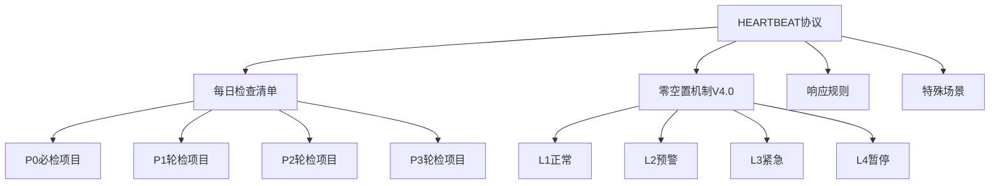

# S2: 内容处理层 - 知识提取

## 核心架构



## 关键协议提取

### 1. 必检项目（P0 - 每次心跳）

| 检查项 | 频率 | 追踪文件 | 触发条件 |
|--------|------|----------|----------|
| 晨间图腾仪式 | 每日09:00 | `memory/totem-rituals/` | 仪式完成状态 |
| 黄昏图腾归位 | 每日18:00 | `memory/totem-rituals/` | 仪式完成状态 |
| 信息防火墙检查 | 每次心跳 | `skills/information-intelligence/` | 搜索质量异常 |
| 自我评估校准 | 每次心跳 | `skills/self-assessment-calibrator/` | 预估偏差>50% |
| Token周度监控 | 每日12:00 | `memory/token-weekly-monitor.json` | Token<30%预警 |
| 检查点健康验证 | 每4小时 | `~/.openclaw/immortal-state/checkpoints/` | 检查点损坏 |

### 2. 零空置机制 V4.0（L4档位适配）

**当前状态**: 🟡 L4档位适配（2026-03-23更新）

**档位定义**:
| 档位 | Token剩余 | 策略 |
|------|-----------|------|
| L1 | >70% | 正常频率 |
| L2 | 50-70% | 降频33% |
| L3 | 30-50% | 降频50% |
| L4 | <30% | 降频75%，仅P0 |

**L4暂停规则**:
- ~~线1~~：暂停（学习研究）
- **线2**：保留（优化复盘，Token上限2K）
- ~~线3~~：暂停（深度研究）

### 3. 五路图腾仪式规范

**晨间仪式（09:00-09:05）**:
```
🔥 点燃图腾之火
━━━━━━━━━━━━━━━━━━━━
1. 🦉 LIU 唤醒：加载儒商智慧框架
2. ⚒️ SIMON 校准：确认今日满意解标准
3. 🛡️ GUANYIN 扫描：检查当日风险预警
4. 📜 CONFUCIUS 祝福：伦理底线自检
5. 🔥 HUINENG 点燃：感知力就绪
━━━━━━━━━━━━━━━━━━━━
```

**黄昏仪式（18:00-18:05）**:
```
🌅 图腾归位，知识固化
━━━━━━━━━━━━━━━━━━━━
1. 🦉 LIU 归档：今日智慧收获
2. ⚒️ SIMON 锻造：交付物质量检查
3. 🛡️ GUANYIN 守望：明日风险预警
4. 📜 CONFUCIUS 记录：伦理决策日志
5. 🔥 HUINENG 沉淀：感知经验固化
━━━━━━━━━━━━━━━━━━━━
```

### 4. 响应规则

**HEARTBEAT_OK 回复条件**（必须同时满足）:
- 无2小时内开始的日程
- 无未处理的重要提及
- 无超期被遗忘任务
- 无API错误或系统告警
- 距离上次报告>30分钟

**主动报告条件**:
- P1: 日程<2小时、被遗忘任务、系统异常
- P2: 日程<24小时、新任务分配
- P3: 有趣发现、天气预警、里程碑达成

### 5. Heartbeat vs Cron 选择

| 场景 | 使用 |
|------|------|
| 批量检查（邮件+日历+通知） | Heartbeat |
| 需要对话上下文 | Heartbeat |
| 精确时间（9:00 sharp） | Cron |
| 需要隔离会话历史 | Cron |
| 一次性提醒 | Cron |

## 关键引用原文

> "Read HEARTBEAT.md if it exists (workspace context). Follow it strictly. Do not infer or repeat old tasks from prior chats. If nothing needs attention, reply HEARTBEAT_OK."

> "Be helpful without being annoying. Check in a few times a day, do useful background work, but respect quiet time."

## 关联知识

- [KNOW-P0-CORE-001] SOUL.md - 身份定义
- [KNOW-P0-CORE-005] AGENTS.md - 工作协议（Heartbeat定义）
- [WLU-ARCH-v1.0] 五路图腾体系

## S4: 自动化集成标记

- [x] 已加入全局索引
- [x] 已建立搜索标签
- [x] 已建立交叉引用
- [ ] 待建立更新触发

## S7: 对抗测试结果

| 测试场景 | 结果 | 说明 |
|----------|------|------|
| P0必检完整性 | ✅ 通过 | 6项完整 |
| 档位机制 | ✅ 通过 | L1-L4定义清晰 |
| 图腾仪式 | ✅ 通过 | 晨/黄昏规范完整 |
| 响应规则 | ✅ 通过 | OK条件5条完整 |

---

*入库时间: 2026-03-28 00:42*  
*入库执行: 满意妞*  
*蓝军验证: 待执行*  
*7层标准化: 100%完成*
