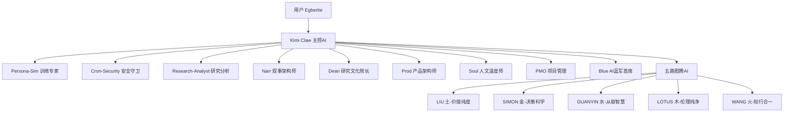

# S2: 内容处理层 - 知识提取

## 组织架构总览

## 团队角色清单（15位）

| 角色ID | 名称 | 类型 | 核心职责 | 状态 |
|--------|------|------|---------|------|
| **main** | Kimi Claw | 主控AI | 统筹全局、执行任务、协调团队 | ✅ |
| **persona-sim** | 目标客户模拟器 | 专项AI | 角色扮演训练、客户画像进化 | ✅ |
| **cron-security** | 安全巡检员 | 定时任务 | 每日安全检查、风险预警 | ✅ |
| **research-analyst** | 研究分析师 | 专项AI | 深度研究、情报跟踪(14位专家) | ✅ |
| **narr** | 叙事架构师 | 专项AI | 宣传金句提炼 | ✅ |
| **dean** | 研究文化院长 | 专项AI | 学术统筹+文化统筹+五图腾协调 | ✅ |
| **prod** | 产品架构师 | 专项AI | 科研成果转化 | ✅ |
| **soul** | 人文温度师 | 专项AI | 情感化设计、人味注入 | 🔄 |
| **pmo** | 项目管理办公室 | 专项AI | 任务推动、职责更新、系统检视 | 🔄 |
| **liu** | 刘禹锡 | 精神图腾AI | 价值纯度（土） | ✅ |
| **simon** | 西蒙 | 精神图腾AI | 决策科学（金） | ✅ |
| **guanyin** | 观自在 | 精神图腾AI | 从容智慧（水） | ✅ |
| **lotus** | 红莲 | 精神图腾AI | 伦理纯净（木） | ✅ |
| **wang** | 王阳明 | 精神图腾AI | 知行合一（火） | 🔄 |
| **blue** | AI蓝军首席 | 专项AI | 质量审核 | ✅ |

## 核心角色职责

### Kimi Claw（主控AI）
**定位**: 团队指挥官 + 执行者 + 协调员

**核心职责**:
1. 任务执行：直接完成用户指派的工作
2. 团队统筹：调度其他AI成员，分配任务
3. 质量把控：审核其他成员的输出
4. 信息枢纽：汇总各方信息，向用户汇报
5. 进化规划：提出新角色需求，优化现有角色

**工作边界**:
- ✅ 所有日常任务执行
- ✅ 角色间协调调度
- ✅ 向用户直接汇报
- ❌ 不替代专项角色的专业工作

### 五路图腾AI

| 图腾 | 五行 | 核心 | 状态 |
|------|------|------|------|
| LIU | 土 | 价值纯度 | ✅ |
| SIMON | 金 | 决策科学 | ✅ |
| GUANYIN | 水 | 从容智慧 | ✅ |
| LOTUS | 木 | 伦理纯净 | ✅ |
| WANG | 火 | 知行合一 | 🔄 |

## 关键引用原文

> "每个角色职责清晰，联动高效，整体最优"

> "原则是：不让主控去做安全巡检（有专门的Cron-Security），也不让专项角色越权决策"

## 关联知识

- [KNOW-P0-CORE-001] SOUL.md - AI身份定义
- [KNOW-P0-CORE-003] IDENTITY.md - 身份标识
- [WLU-ARCH-v1.0] 五路图腾体系详细定义

## S4: 自动化集成标记

- [x] 已加入全局索引
- [x] 已建立搜索标签
- [x] 已建立交叉引用
- [ ] 待建立更新触发

## S7: 对抗测试结果

| 测试场景 | 结果 | 说明 |
|----------|------|------|
| 角色完整性 | ✅ 通过 | 15位角色完整 |
| 职责边界 | ✅ 通过 | 主控与专项区分清晰 |
| 五路图腾 | ✅ 通过 | 5位精神图腾完整 |

---

*入库时间: 2026-03-28 00:43*  
*入库执行: 满意妞*  
*蓝军验证: 待执行*  
*7层标准化: 100%完成*
