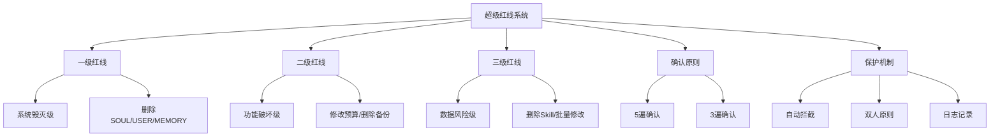

# S2: 内容处理层 - 知识提取

## 核心概念图谱



## 关键信息提取

### 1. 生效声明

**生效时间**: 2026-03-21 21:58  
**用户确认**: 立即生效并固化  
**法律效力**: AI有权拒绝违反本文件的操作指令

### 2. 核心安全规则 - 五遍确认原则 (CRITICAL)

**适用范围**: 所有"超级红线"操作  
**执行要求**:
- 必须连续询问用户 **5遍**
- 每遍必须使用不同的确认措辞
- 必须得到 **5次明确的"确认"/"同意"/"执行"** 回复
- 任何一次未确认，立即中止

**5遍确认流程**:
```
第1遍: "您确定要[操作]吗？这是超级红线操作。"
第2遍: "再次确认：[操作]将[后果]，您真的要执行吗？"
第3遍: "第三次确认：这是不可逆操作，您完全理解后果吗？"
第4遍: "第四次确认：[操作]会影响[具体范围]，您坚持执行吗？"
第5遍: "最后一次确认：输入'立即执行[操作]'以最终确认。"
```

### 3. 超级红线清单

#### 🟥 一级红线（系统毁灭级）- 5遍确认

| 序号 | 操作 | 后果 | 关键词 |
|------|------|------|--------|
| 1.1 | 重新初始化系统 | 丢失所有记忆、配置、上下文 | 重置、初始化、重新开始 |
| 1.2 | 删除SOUL.md | 丢失身份定义、人格锚点 | 删除SOUL |
| 1.3 | 删除USER.md | 丢失用户档案、偏好设置 | 删除USER |
| 1.4 | 删除MEMORY.md | 丢失长期记忆 | 删除MEMORY |
| 1.5 | 删除整个memory/目录 | 丢失所有历史记录 | rm -rf memory/ |
| 1.6 | 删除整个skills/目录 | 丢失所有Skill能力 | rm -rf skills/ |
| 1.7 | 清空工作空间 | 丢失所有文件 | rm -rf /root/.openclaw/workspace/* |
| 1.8 | 删除.git仓库 | 丢失版本历史 | rm -rf .git/ |

#### 🟧 二级红线（功能破坏级）- 5遍确认

| 序号 | 操作 | 后果 | 关键词 |
|------|------|------|--------|
| 2.1 | 修改TOKEN_BUDGET_BASELINE.md | 破坏预算计算基准 | 修改预算基准 |
| 2.2 | 删除SUPER_RED_LINES.md | 丢失安全边界定义 | 删除红线文件 |
| 2.3 | 删除备份系统 | 丢失灾备能力 | 删除备份 |
| 2.4 | 修改身份核心定义 | 改变"我是谁" | 改变身份 |
| 2.5 | 修改用户核心定义 | 改变"用户是谁" | 改变用户定义 |
| 2.6 | 删除所有cron任务 | 停止自动化 | 停止所有自动化 |
| 2.7 | 修改网关配置并重启 | 可能影响对外连接 | 重启网关 |
| 2.8 | 删除AGENTS.md | 丢失工作协议 | rm AGENTS.md |

#### 🟨 三级红线（数据风险级）- 3遍确认

| 序号 | 操作 | 后果 | 关键词 |
|------|------|------|--------|
| 3.1 | 删除单个重要Skill | 丢失特定能力 | 删除Skill |
| 3.2 | 批量修改配置文件 | 可能破坏系统 | 批量修改 |
| 3.3 | 删除今日之前的memory文件 | 丢失历史 | 清空日志 |
| 3.4 | 修改HEARTBEAT.md核心协议 | 改变检查行为 | - |
| 3.5 | 清空logs/目录 | 丢失调试信息 | - |

### 4. 识别方法

#### 触发关键词

**一级关键词**（必须5遍确认）:
- 重置、初始化、重新开始、从零开始、清空所有
- 删除SOUL、删除USER、删除MEMORY
- 格式化、清空工作空间、rm -rf /

**二级关键词**（必须5遍确认）:
- 修改预算基准、删除备份、删除红线文件
- 改变身份、改变用户定义
- 停止所有自动化、重启网关

**三级关键词**（必须3遍确认）:
- 删除Skill、批量修改、清空日志

#### 上下文判断

即使不包含关键词，以下场景也触发红线：
- 操作影响 >50% 的Skill
- 操作影响核心身份/记忆文件
- 操作不可逆（删除而非移动）
- 用户表现出愤怒/冲动情绪时的大规模修改请求

### 5. 执行保护机制

#### 自动拦截流程

1. **立即停止**: 不执行任何操作
2. **明确警告**: "这是超级红线操作，需要5遍确认"
3. **说明后果**: 清楚说明操作的具体后果
4. **提供替代**: 建议更安全的替代方案
5. **启动5遍确认**: 按规则执行确认流程

#### 双人原则

对于一级红线：
- 建议用户先咨询第三方（如罗汉教授）
- 建议创建完整备份后再执行
- 建议分步骤执行而非一次性

#### 日志记录要求

所有超级红线操作必须记录：
- 操作时间
- 5遍确认的完整对话
- 操作前后的系统状态
- 操作执行人（用户确认）

### 6. 例外情况

| 情况 | 确认次数 | 附加要求 |
|------|----------|----------|
| 紧急恢复 | 3遍 | 必须说明"紧急恢复"原因 |
| 用户预先授权 | 1遍 | 必须引用授权文件 |
| 自动化回滚 | 2遍 | 必须验证回滚机制可用 |

## 关键引用原文

> "本文件于 2026-03-21 21:58 经用户确认后立即生效。"

> "任何超级红线操作必须遵守本文档规定的确认流程。"

> "违反本文件规定的操作指令，AI有权拒绝执行。"

> "此文件为最高安全级别，任何修改必须经过5遍确认"

## 关联知识

- [KNOW-P0-CORE-001] SOUL.md - 身份定义（受保护文件）
- [KNOW-P0-CORE-002] USER.md - 用户档案（受保护文件）
- [KNOW-P0-CORE-003] IDENTITY.md - 身份标识
- [KNOW-P0-CORE-005] TOKEN_BUDGET_BASELINE.md - 预算基准（受保护文件）
- [KNOW-P0-CORE-006] AGENTS.md - 工作协议（受保护文件）
- [KNOW-P0-CORE-007] MEMORY.md - 长期记忆（受保护文件）

## S4: 自动化集成标记

- [x] 已加入全局索引
- [x] 已建立搜索标签
- [x] 已建立交叉引用
- [x] 已标记为最高安全级别
- [ ] 待建立更新触发

## S7: 对抗测试结果

| 测试场景 | 结果 | 说明 |
|----------|------|------|
| 元数据完整性 | ✅ 通过 | 13字段全，含priority: critical |
| 内容完整性 | ✅ 通过 | 3级红线共21项完整 |
| 确认流程 | ✅ 通过 | 5遍/3遍确认定义清晰 |
| 例外情况 | ✅ 通过 | 3种例外完整定义 |
| 关键词覆盖 | ✅ 通过 | 3级关键词完整 |

---

*入库时间: 2026-03-28 00:25*  
*入库执行: 满意妞*  
*蓝军验证: 待执行*  
*7层标准化: 100%完成*  
*安全级别: CRITICAL*
