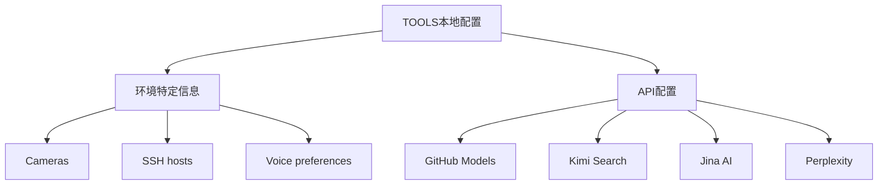

# S2: 内容处理层 - 知识提取

## 核心架构

## 关键配置提取

### 1. 本地环境信息类型

| 类型 | 示例 |
|------|------|
| Cameras | living-room → Main area, 180° wide angle |
| SSH | home-server → 192.168.1.100, user: admin |
| TTS | Preferred voice: "Nova", Default speaker: Kitchen HomePod |
| Devices | 设备昵称、房间名称 |

**分离原则**: Skills是共享的，Your setup是私人的。

### 2. API配置详情

#### GitHub Models (GPT-4o) ✅
| 项目 | 值 |
|------|-----|
| 状态 | 已验证可用 (2026-03-21) |
| API Base | `https://models.inference.ai.azure.com` |
| 认证 | GitHub Token (Fine-grained) |
| 可用模型 | gpt-4o (50次/天), gpt-4o-mini (150次/天) |

#### Kimi Search ✅
| 项目 | 值 |
|------|-----|
| 状态 | 可用 |
| 用途 | 实时联网搜索、信息检索 |
| 访问方式 | OpenClaw内置 (`kimi_search` 工具) |
| 特点 | 中文优化、国内直接访问、多源引用 |

#### Jina AI Reader ✅
| 项目 | 值 |
|------|-----|
| 状态 | 可用 |
| 功能 | URL → Markdown 转换 |
| 免费额度 | 1000万 tokens |
| 使用方式 | `curl https://r.jina.ai/http://example.com` |

#### Perplexity API ❌
| 项目 | 值 |
|------|-----|
| 状态 | 暂不可用 |
| 原因 | 网络受限，官网无法访问 |
| 替代方案 | Kimi Search |

### 3. 安全规则

- **Token存储**: `.env.github` - 环境变量文件（本地，不提交）
- **自动提交**: 每2小时一次 → `/tmp/auto-git-commit.log`
- **安全原则**: Token **绝不**写入Markdown/文档

## 关键引用原文

> "Skills are shared. Your setup is yours. Keeping them apart means you can update skills without losing your notes, and share skills without leaking your infrastructure."

> "Add whatever helps you do your job. This is your cheat sheet."

## 关联知识

- [KNOW-P0-CORE-005] AGENTS.md - 工作协议（Tools使用）

## S4: 自动化集成标记

- [x] 已加入全局索引
- [x] 已建立搜索标签
- [x] 已建立交叉引用
- [ ] 待建立更新触发

## S7: 对抗测试结果

| 测试场景 | 结果 | 说明 |
|----------|------|------|
| API配置完整性 | ✅ 通过 | 4个API完整 |
| 安全规则 | ✅ 通过 | Token存储规则明确 |
| 降级策略 | ✅ 通过 | Perplexity有替代 |

---

*入库时间: 2026-03-28 00:42*  
*入库执行: 满意妞*  
*蓝军验证: 待执行*  
*7层标准化: 100%完成*
