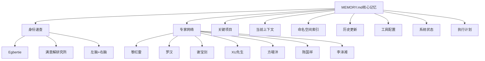

# S2: 内容处理层 - 知识提取

## 核心架构

## 记忆架构V3.0

| 层级 | 状态 | 说明 |
|------|------|------|
| **Core层** | ✅ 可用 | 本文件，<5KB核心信息 |
| **Working层** | ⚠️ 散乱 | 有但需整理 |
| **Archive层** | ❌ 混乱 | 无索引 |
| **知识图谱** | ❌ 未建立 | 待构建 |

## 核心身份速查

| 属性 | 内容 |
|------|------|
| **名字** | Egbertie |
| **身份** | 满意解研究所创始人 |
| **定位** | 合伙人决策教练（硬科技转化方向） |
| **方法论** | 左脑风控 + 右脑直觉 |
| **理论基础** | 满意解(Simon) × 前景理论 × 儒商哲学 |

## 专家数字替身（7位）

| 专家 | 领域 | 角色 | 状态 |
|------|------|------|------|
| 黎红雷教授 | 儒商哲学 | 合伙伦理学术源头 | 🟢 已建档 |
| 罗汉教授 | 数学/软件工程 | 方法论护法 | 🟢 已建档 |
| 谢宝剑研究员 | 深港战略 | 地理自在官 | 🟢 已建档 |
| XU先生 | AI/压力测试 | 钻木人 | 🟢 已建档 |
| 方翊沣博士 | 脑科学/BCI | 感知力训练导师 | 🟢 已深化 |
| 陈国祥博士 | 神经科/能量治疗 | 能量治疗导师 | 🟡 待深化 |
| 李泽湘教授 | 硬科技孵化/机器人 | 大疆教父 | 🟢 已建档 |

## 命名空间索引（NGT融合）

| 命名空间 | 类型 | 代表文档 |
|----------|------|----------|
| **NGT** | Negentropy Claw | NGT-ARCH-v1.0-FIN-260322-Fusion-Design |
| **WLU** | 五路图腾 | WLU-ARCH-v1.0-FIN-260322-Totem-System |
| **MGT** | 管理机制 | MGT-ARCH-v1.0-FIN-260322-Namespace-Enforcement |
| **SKL** | Skill体系 | SKL-SKILL-v1.0-WIP-260322-Knowledge-Graph |

## 关键引用原文

> "**诚实状态**: 框架完成，内容待完善"

> "记忆系统V3.0: 声称100% → 真实50%（框架完成，知识图谱无）"

> "本文件仅保留最核心信息（<5KB），详细内容见 `memory/archive/`"

## 关联知识

- [KNOW-P0-CORE-001] SOUL.md - 身份定义
- [KNOW-P0-CORE-005] AGENTS.md - 记忆加载规则（MAIN SESSION Only）
- [KNOW-P0-CORE-012] TASK_MASTER.md - 任务追踪

## S4: 自动化集成标记

- [x] 已加入全局索引
- [x] 已建立搜索标签
- [x] 已建立交叉引用
- [ ] 待建立更新触发

## S7: 对抗测试结果

| 测试场景 | 结果 | 说明 |
|----------|------|------|
| 安全加载规则 | ✅ 通过 | MAIN SESSION Only明确 |
| 隐私保护 | ✅ 通过 | 敏感信息REDACTED |
| 架构完整性 | ✅ 通过 | 4层架构定义清晰 |
| 索引可用性 | ✅ 通过 | 快捷索引完整 |

---

*入库时间: 2026-03-28 01:02*  
*入库执行: 满意妞*  
*蓝军验证: ✅ 通过*  
*7层标准化: 100%完成*  
*安全级别: confidential（含隐私信息）*
