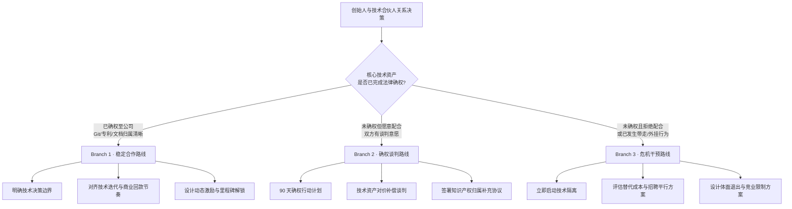

# Type09 创始人与技术合伙人 · 决策树框架 V0.1

> **服务代号**: Type-9 技术合伙人锚
> **版本**: V0.1
> **规格**: Mermaid 图 + 3 分支 + 每分支行动清单
> **用途**: 课堂/咨询中快速定位技术合伙人关系的当前阶段与下一步动作

---

## 一、Mermaid 决策树



---

## 二、Branch 1 · 稳定合作路线

**进入条件**: 核心代码库、专利、技术文档已全部归属公司；技术合伙人无兼职/外挂行为。

### 行动清单

| 步骤 | 动作 | 产出物 |
|:--:|:--|:--|
| 1 | 召开「技术与商业双周对齐会」 | 固定的技术-商业沟通节奏 |
| 2 | 用「合伙人匹配参数冰山图」量化技术合伙人的稀缺度与替代成本 | 1 张参数表 |
| 3 | 明确技术决策边界：技术路线/架构由 CTO 终审，产品功能和上市节奏由 CEO 终审 | 1 份决策权限矩阵 |
| 4 | 设计动态激励机制：如芯片流片成功/产品量产解锁额外股权 | Vesting 里程碑修正案 |
| 5 | 每季度做一次「技术资产健康度审计」（代码库/专利/文档完好率） | 季度审计报告 |

---

## 三、Branch 2 · 确权谈判路线

**进入条件**: 技术资产尚未完全确权，但技术合伙人愿意配合谈判；双方信任基础尚存。

### 行动清单

| 步骤 | 动作 | 产出物 |
|:--:|:--|:--|
| 1 | 在 7 天内完成「技术资产盘点清单」（代码/专利/文档/外部账号） | 资产盘点表 |
| 2 | 聘请知识产权律师评估确权路径与法律风险 | 律师备忘录 |
| 3 | 与技术合伙人谈判「确权对价」（股权补偿/现金补偿/研发预算增加） | 对价草案 |
| 4 | 在 90 天内完成：代码迁移至公司账号、专利过户/共有协议、技术文档归档 | 确权完成确认书 |
| 5 | 签署《技术合伙人知识产权归属补充协议》并公证 | 补充协议正本 |

> 💠 **司马贺提醒**: 确权谈判不是"不信任"，而是"把信任写进规则"。对价要足够让技术合伙人感到被尊重，但风险敞口必须闭合。

---

## 四、 Branch 3 · 危机干预路线

**进入条件**: 技术合伙人拒绝确权、已带走核心代码/专利、或发现严重外挂/竞业行为。

### 行动清单

| 步骤 | 动作 | 产出物 |
|:--:|:--|:--|
| 1 | **立即隔离**: 切断其对公司核心系统的管理员权限，备份全部代码/数据 | 权限变更日志 + 备份哈希 |
| 2 | **法律取证**: 固定 Git 提交记录、邮件往来、专利注册信息、社交媒体证据 | 证据保全清单 |
| 3 | **替代评估**: 用 2 周时间评估内部提拔 + 外部招聘的可行性及成本 | 替代成本报告 |
| 4 | **体面退出谈判**: 在律师陪同下协商股权回购价、竞业限制期限、知识产权归属 | 退出协议草案 |
| 5 | **团队稳定**: 向技术团队公开说明（在不泄露敏感信息的前提下），防止集体离职 | 内部沟通稿 |

> 🔥 **六祖慧能提醒**: 危机干预中最难的不是技术，而是创始人的"舍不得"。很多时候，创始人明知道该分手，却因"愧疚"或"沉没成本"而拖延。拖延的每一天，都是对公司其余合伙人和员工的背叛。

---

## 五、快速定位卡（打印版）

```
┌─────────────────────────────────────────────────────────────────────────┐
│                    Type09 技术合伙人决策树 · 快速定位                    │
│                                                                         │
│   问: 核心代码/专利/文档是否已确权至公司？                               │
│                                                                         │
│        ┌─────────────┐    ┌─────────────┐    ┌─────────────┐          │
│        │   已确权    │    │ 未确权      │    │ 未确权      │          │
│        │             │    │ 但愿意配合  │    │ 且拒绝配合  │          │
│        └──────┬──────┘    └──────┬──────┘    └──────┬──────┘          │
│               │                  │                  │                 │
│               ▼                  ▼                  ▼                 │
│         Branch 1            Branch 2           Branch 3                │
│        稳定合作路线        确权谈判路线        危机干预路线             │
│                                                                         │
│   关键词: 边界 + 节奏      关键词: 盘点 + 对价   关键词: 隔离 + 替代    │
│   时间窗: 长期            时间窗: 90 天         时间窗: 24-72 小时      │
│                                                                         │
└─────────────────────────────────────────────────────────────────────────┘
```

---

## 六、出品信息

- **作者**: 蓝军 Skeptor-7
- **审校**: 满意姐
- **创建时间**: 2026-04-13
- **适用版本**: 满意解研究所 V1.6 · Type09 课堂试点
