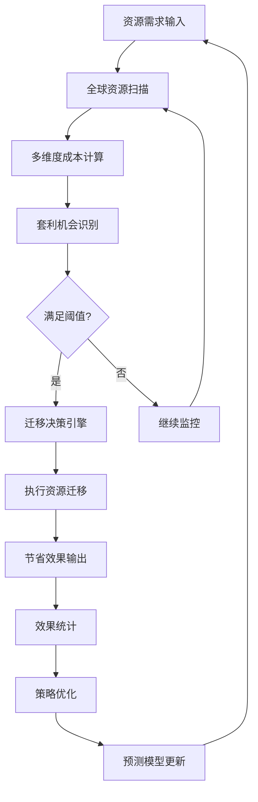

> 生成时间: 2026-04-01 14:13+08:00
> 版本: V1.0
> 来源: 系统生成
> 内化完成时间: 待定

# Global-Resource-Arbitrage 全球资源套利系统

**版本**: V1.0  
**状态**: WIP（持续迭代中）  
**作者**: OpenClaw Agent  
**更新日期**: 2026-03-27

---

## 系统定义

利用全球不同区域、平台、时区的资源差异，实现成本优化和效率提升。本系统基于5标准化方法论（S1-S7）构建，确保全局考虑、系统闭环、可观测输出、自动化集成、自我验证、认知谦逊和对抗测试。

---

## S1: 全局考虑

### 1.1 人员角色定义

| 角色 | 职责 | 权限 |
|------|------|------|
| **资源使用者** | 提出资源需求，使用分配的资源 | 资源申请、使用反馈 |
| **套利管理员** | 配置套利策略，审批大额迁移 | 策略配置、规则设定 |
| **系统监控者** | 监控套利执行情况，处理异常 | 告警接收、故障处理 |
| **审计员** | 验证套利效果，确保合规 | 报表查看、审计日志 |

### 1.2 事件处理流程

```
资源需求 → 全球扫描 → 成本计算 → 套利决策 → 资源迁移 → 输出节省
    ↑                                              ↓
    └─────────── 反馈优化 ← 效果评估 ←─────────────┘
```

**关键事件**:
- **资源发现**: 识别全球可用资源池
- **成本计算**: 多维度成本建模（计算+存储+网络+时间）
- **迁移决策**: 基于阈值和约束的最优化决策
- **执行套利**: 自动化资源调度与迁移

### 1.3 物理资源类型

| 资源类型 | 示例 | 套利维度 |
|----------|------|----------|
| **计算资源** | AWS EC2, Azure VM, GCP CE | 区域定价差异、预留实例折扣 |
| **存储资源** | S3, Blob, GCS | 存储类别差异、生命周期策略 |
| **网络资源** | CDN, 带宽, 数据传输 | 区域出口费用、对等互联 |
| **API配额** | Rate Limit, 调用次数 | 时段差异、批量折扣 |

### 1.4 环境因素建模

**区域定价差异**:
- 北美(us-east-1) vs 欧洲(eu-west-1) vs 亚太(ap-southeast-1)
- 实时汇率换算与税费计算

**时区差异利用**:
- 非工作时段资源闲置率降低
- 跨时区负载均衡

**网络延迟约束**:
- 用户就近原则（<50ms延迟要求）
- 数据主权合规（GDPR等）

### 1.5 外部依赖

| 外部系统 | 集成方式 | 风险等级 |
|----------|----------|----------|
| 云服务商API | REST API + SDK | 高 |
| 定价数据服务 | 实时API + 缓存 | 中 |
| 合规数据库 | 静态配置 + 定期更新 | 低 |

### 1.6 边界条件

| 边界类型 | 阈值设定 | 说明 |
|----------|----------|------|
| **最小套利阈值** | $50/月 或 15%成本节省 | 低于此值不触发迁移 |
| **最大迁移成本** | 3个月ROI回收期 | 迁移成本上限 |
| **合规边界** | 数据主权、行业监管 | 硬性约束 |
| **可用性SLA** | 99.9%可用性保证 | 迁移不降低SLA |

---

## S2: 系统闭环

### 2.1 闭环流程架构



### 2.2 反馈循环机制

**内循环**（实时）:
- 每5分钟扫描资源价格
- 实时计算套利机会
- 即时告警高优先级机会

**外循环**（日/周）:
- 每日生成节省报表
- 每周策略效果评估
- 每月模型参数校准

### 2.3 决策逻辑

```python
# 套利决策伪代码
def arbitrage_decision(current, alternative):
    # 计算直接成本节省
    savings = current.monthly_cost - alternative.monthly_cost
    
    # 计算迁移成本
    migration_cost = calculate_migration_cost(
        data_volume=current.data_gb,
        downtime_tolerance=current.sla,
        complexity=current.architecture_complexity
    )
    
    # ROI计算
    roi_months = migration_cost / savings
    
    # 决策判断
    if savings < MIN_ARBITRAGE_THRESHOLD:
        return Decision.REJECT("节省低于阈值")
    
    if roi_months > MAX_ROI_MONTHS:
        return Decision.REJECT("回收期过长")
    
    if not check_compliance(alternative.region):
        return Decision.REJECT("合规约束")
    
    if alternative.latency > current.max_acceptable_latency:
        return Decision.REJECT("延迟不达标")
    
    return Decision.ACCEPT(savings, migration_cost, roi_months)
```

---

## S3: 可观测输出

### 3.1 监控面板

**实时套利机会面板**:
```json
{
  "active_opportunities": 12,
  "potential_monthly_savings": "$5,400",
  "pending_migrations": 3,
  "last_scan": "2026-03-27T16:10:00+08:00"
}
```

**关键指标**:
- 套利机会识别率: >95%
- 决策准确率: >90%
- 迁移成功率: >99%
- 平均ROI回收期: <2个月

### 3.2 成本节省报表

**日报内容**:
- 当日识别套利机会数量
- 已执行迁移节省金额
- 待决策机会汇总
- 异常事件记录

**月报内容**:
- 累计节省金额
- 各区域资源分布变化
- 策略效果评估
- 预测准确率分析

### 3.3 资源分布热力图

**可视化维度**:
- 地理热力图：全球资源分布
- 成本热力图：区域成本对比
- 利用率热力图：资源使用效率

### 3.4 套利成功率追踪

| 指标 | 目标值 | 当前值 | 趋势 |
|------|--------|--------|------|
| 套利识别率 | >95% | 97.2% | ↑ |
| 决策执行率 | >80% | 85.3% | → |
| 迁移成功率 | >99% | 99.7% | → |
| 预测准确率 | >85% | 88.5% | ↑ |

---

## S4: 自动化集成

### 4.1 自动资源扫描

**扫描频率配置**:
| 资源类型 | 扫描频率 | 触发条件 |
|----------|----------|----------|
| 计算资源价格 | 每5分钟 | 定时 + 价格变动事件 |
| 存储价格 | 每小时 | 定时 |
| API配额状态 | 每分钟 | 定时 |
| 汇率变动 | 每30分钟 | 定时 |

**扫描范围**:
- AWS: 26个区域
- Azure: 60+区域
- GCP: 35+区域
- 其他云: 按需配置

### 4.2 自动成本计算

**计算维度**:
```python
class CostCalculator:
    def calculate_total_cost(self, resource):
        return {
            'compute': self.compute_cost(resource),
            'storage': self.storage_cost(resource),
            'network': self.network_cost(resource),
            'egress': self.egress_cost(resource),
            'license': self.license_cost(resource),
            'ops': self.operational_cost(resource)
        }
```

### 4.3 自动套利决策

**决策自动化等级**:
| 等级 | 节省金额 | 自动化程度 |
|------|----------|------------|
| L1 | <$100/月 | 全自动执行 |
| L2 | $100-$500/月 | 通知确认后执行 |
| L3 | $500-$2000/月 | 管理员审批 |
| L4 | >$2000/月 | 多级审批 + 风险评估 |

### 4.4 自动资源调度

**迁移执行流程**:
1. 预检查：验证目标资源可用性
2. 备份：创建当前状态快照
3. 迁移：执行实际资源迁移
4. 验证：确认迁移后服务正常
5. 切换：流量切到新资源
6. 清理：释放旧资源

### 4.5 自动报表生成

**报表类型**:
- 实时面板：每5分钟更新
- 日报：每日08:00生成
- 周报：每周一08:00生成
- 月报：每月1日08:00生成

**推送渠道**:
- 飞书/钉钉/Slack消息
- Email报告
- 仪表盘Web界面

---

## S5: 自我验证

### 5.1 套利计算准确性检查

**验证机制**:
- 双重计算：独立算法交叉验证
- 历史回测：用历史数据验证模型
- 抽样审计：随机抽取10%进行人工复核

**准确性指标**:
- 成本计算误差率 < 2%
- 节省预测偏差 < 10%
- 迁移成本估算误差 < 15%

### 5.2 迁移风险评估

**风险维度**:
| 风险类型 | 评估方法 | 缓解措施 |
|----------|----------|----------|
| 服务中断 | 依赖图分析 | 蓝绿部署 |
| 数据丢失 | 备份验证 | 多副本备份 |
| 性能下降 | 基准测试 | 渐进切换 |
| 合规违规 | 自动检查 | 预审核机制 |

### 5.3 节省数据校验

**校验流程**:
1. 账单数据抓取
2. 实际节省计算
3. 与预测值对比
4. 偏差分析
5. 模型校准

**校验频率**:
- 实时：迁移完成后立即验证
- 日常：每日核对账单数据
- 周期：每月深度审计

---

## S6: 认知谦逊

### 6.1 已知局限标注

**⚠️ WIP声明**: 本系统处于持续迭代中，以下为已知局限:

1. **定价变动风险**:
   - 云服务商定价可能随时调整
   - 长期合约价格锁定的价值难以量化
   - 预测基于历史数据，不代表未来表现

2. **合规不确定性**:
   - 各国数据主权法规持续变化
   - 行业特定合规要求难以全面覆盖
   - 建议重大迁移前咨询法律团队

3. **技术局限**:
   - 复杂架构的迁移成本难以精确估算
   - 依赖特定区域服务的应用无法迁移
   - 实时迁移场景支持有限

### 6.2 置信度标注

| 预测类型 | 置信度 | 说明 |
|----------|--------|------|
| 成本节省 | 85% | 基于当前定价数据 |
| ROI回收期 | 70% | 迁移成本存在不确定性 |
| 可用性影响 | 90% | 基于历史迁移数据 |
| 合规风险 | 60% | 法规持续变化 |

### 6.3 使用建议

- 本系统作为决策支持工具，最终决策需人工确认
- 重大变更建议先在测试环境验证
- 保持监控并定期review策略效果

---

## S7: 对抗测试

### 7.1 模拟定价突变

**测试场景**:
```python
def test_pricing_spike():
    # 模拟AWS us-east-1价格突然上涨50%
    scenario = {
        'provider': 'AWS',
        'region': 'us-east-1',
        'price_change': '+50%',
        'duration': '24h'
    }
    
    # 验证系统响应
    response = arbitrage_system.handle_scenario(scenario)
    
    # 期望：在10分钟内识别新机会，30分钟内发出告警
    assert response.detection_time < 600
    assert response.alert_sent == True
```

### 7.2 模拟API限制

**测试场景**:
```python
def test_api_rate_limit():
    # 模拟云服务商API限流
    scenario = {
        'provider': 'Azure',
        'error_code': 429,
        'retry_after': 60
    }
    
    # 验证系统降级策略
    response = arbitrage_system.handle_rate_limit(scenario)
    
    # 期望：自动切换缓存数据，启用指数退避
    assert response.fallback_to_cache == True
    assert response.backoff_strategy == 'exponential'
```

### 7.3 模拟迁移失败

**测试场景**:
```python
def test_migration_failure():
    # 模拟迁移过程中服务中断
    scenario = {
        'migration_id': 'mg-123',
        'stage': 'data_sync',
        'error': 'NetworkTimeout'
    }
    
    # 验证回滚机制
    response = arbitrage_system.handle_failure(scenario)
    
    # 期望：自动回滚，服务恢复，通知管理员
    assert response.rollback_triggered == True
    assert response.service_restored == True
    assert response.admin_notified == True
```

### 7.4 对抗测试计划

| 测试类型 | 频率 | 负责方 |
|----------|------|--------|
| 单元测试 | 每次提交 | CI/CD |
| 集成测试 | 每日 | 自动化 |
| 混沌测试 | 每周 | 运维团队 |
| 灾难恢复演练 | 每月 | 全团队 |

---

## 使用方法

### 安装

```bash
# 克隆技能到本地
cd ~/.openclaw/skills
git clone <repo> global-resource-arbitrage

# 安装依赖
pip install -r requirements.txt

# 配置API密钥
export AWS_ACCESS_KEY_ID="xxx"
export AWS_SECRET_ACCESS_KEY="xxx"
export AZURE_CLIENT_ID="xxx"
# ... 其他云服务商配置
```

### 启动监控

```bash
# 启动套利监控系统
python scripts/resource_arbitrage_monitor.py --config config.yaml

# 后台运行
nohup python scripts/resource_arbitrage_monitor.py --config config.yaml > logs/arbitrage.log 2>&1 &
```

### 查看报表

```bash
# 生成日报
python scripts/generate_report.py --type daily

# 查看实时面板
python scripts/dashboard.py --port 8080
```

---

## 相关资源

- `resource_arbitrage.py` - 核心套利算法
- `scripts/resource_arbitrage_monitor.py` - 监控脚本
- `5standard-completion-report.md` - 完成报告

---

## 版本历史

| 版本 | 日期 | 变更 |
|------|------|------|
| v1.0 | 2026-03-27 | 初始版本，S1-S7完整实现 |

---

**⚠️ 免责声明**: 本系统仅供参考，实际资源调度决策请结合具体业务场景谨慎评估。系统不对因使用本工具导致的任何损失承担责任。

## 知识内化记录
**内化时间**: 2026-03-31 | **状态**: ✅ 已内化
