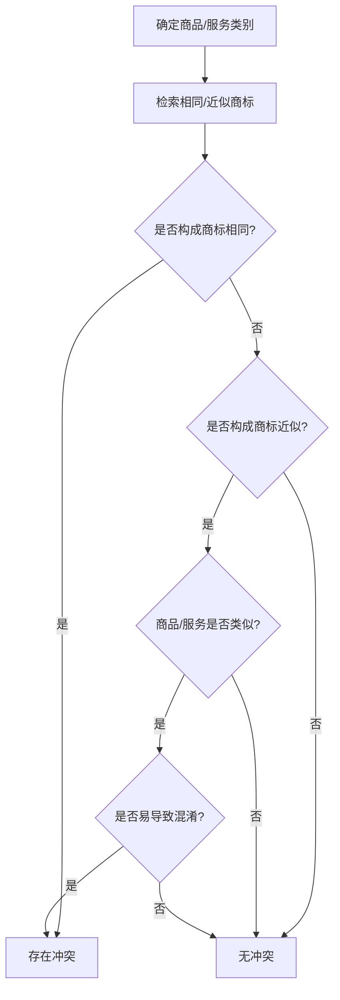

# 商标侵权判断分析技能

## 概述

本技能基于以下法规文件,提供系统化、专业化的商标侵权判断分析服务:
- 国家知识产权局《商标侵权判断标准》(国知发保字〔2020〕23号)及其《理解与适用》
- 《商标审查审理指南》(2021版) - 商标注册检索判断指引
- 《中华人民共和国商标法》及其实施条例

**适用场景**:
- 代理人判断涉案商标是否构成侵权
- 客户侵权风险咨询答复
- 商标案件分析与证据固定
- 商标相同/近似性判断
- 混淆可能性分析
- 商标注册检索判断

分析前,先读取以下参考资料以获取完整的判断标准:
- `references/trademark_infringement_standards.md` - 商标侵权判断标准
- `references/trademark_examination_guide_2021.md` - 商标审查审理指南要点
- `references/trademark_use_evidence_guide.md` - 商标使用证据详细指南
- `references/trademark_law_core_provisions.md` - 商标法核心条款参考

---

## 一、核心判断体系

### 1.1 标准分析流程(五步法)

对每一个商标侵权判断请求,严格按以下五步递进分析:

#### 第一步:是否构成"商标的使用"

判断涉案行为是否属于商标法意义上的商标使用(用以识别商品或服务来源的行为)。

**商标使用的具体形式**:

**商品商标使用**:
- 直接贴附、刻印、烙印、编织等方式附着于商品/包装/容器/标签/附加标牌/说明书/价目表
- 使用在商品销售合同、发票、票据、收据、进出口检验检疫证明、报关单据等交易文书
- 在广播、电视、媒体、出版物、广告牌、邮寄广告等广告宣传中使用
- 在展览会、博览会等场合使用

**服务商标使用**:
- 直接用于服务场所:介绍手册、招牌、店堂装饰、工作人员服饰、招贴、菜单、价目表
- 用于服务相关用品:奖券、办公文具、信笺等
- 用于服务交易文书:发票、汇款单据、提供服务协议、维修维护证明
- 在广播、电视、媒体、出版物、广告牌等广告宣传中使用

**不属于商标使用的情形**:
- 商标注册信息的公布或者商标注册人关于对其注册商标享有专用权的声明
- 未在公开的商业领域使用
- 仅作为赠品使用(赠品上未单独标注商标)
- 仅有转让或许可行为而没有实际使用
- 仅以维持商标注册为目的的象征性使用(如:仅在年报中标注商标)

**实务判定示例**:
- ✗ 不构成商标使用:企业年报中标注"公司持有XXX商标",仅说明权利归属
- ✗ 不构成商标使用:赠品上未单独标注商标,仅标注企业名称
- ✓ 构成商标使用:商品外包装、销售合同、宣传材料中标注商标

**商标使用证据举证清单**:
| 维度 | 举证要点 | 示例证据 |
|------|---------|---------|
| 载体 | 证明商标在商业活动中实际使用 | 商品包装、发票、合同、广告 |
| 时间 | 证明使用时间明确 | 销售记录上的日期、广告发布日期 |
| 地域 | 证明使用地域范围 | 销售地区、广告投放区域 |
| 知名度 | 证明商标的识别性和影响力 | 销售额、市场份额、媒体报道 |

**综合考量因素**:
- 使用人主观意图
- 使用方式可见性
- 宣传方式稳定性
- 行业惯例
- 消费者认知

**例外**:商标法第57条第4项(伪造/擅自制造商标标识)无需判断商标使用,直接进入侵权认定。

---

#### 第二步:是否未经商标注册人许可

确认是否属于以下情形之一:
- 完全未获得许可
- 超出许可范围(类别、期限、数量、店铺数量等)

**举证要点**:
- 无许可:无需举证
- 超出许可范围:许可合同、核准注册的商品类别、许可期限等证明

---

#### 第三步:商品/服务的同一种或类似关系

**比对对象**:权利人注册商标**核定使用**的商品/服务(非权利人实际使用的商品) vs 涉嫌侵权的商品/服务

**认定步骤**:
1. 查询现行《类似商品和服务区分表》中的类似群组
2. 区分表未涵盖的,综合考虑:
   - **商品**:功能、用途、主要原料、生产部门、消费对象、销售渠道
   - **服务**:目的、内容、方式、提供者、对象、场所
3. 遵循"从新兼从轻"原则

**官方查询渠道**:
- 国家知识产权局商标局官网: https://sbj.cnipa.gov.cn/
- 商标检索系统: https://sbj.cnipa.gov.cn/sbj/sbsj/
- 区分表版本更新:每年更新,需使用最新版本

**非区分表商品的类似性判断示例**:
- ✓ 类似:"智能手环" vs "智能手表"(功能、用途、消费对象高度重合)
- ✗ 不类似:"白酒杯" vs "白酒"(功能、用途完全不同,前者为容器,后者为饮品)

---

#### 第四步:商标相同或近似的认定

**比对对象**:权利人**核准注册**的商标(非实际使用的商标) vs 涉嫌侵权商标

**核心规则**:
- **组合商标**:文字部分为核心识别要素,优先比较文字部分
- **图形商标**:构图要素和整体视觉效果
- **权重顺序**:文字 > 图形 > 颜色

##### 4.1 商标相同判断(参照《商标审查审理指南》)

**核心标准**:视觉效果或听觉感知基本无差别、相关公众难以分辨

**文字商标相同**:
| 情形 | 示例 | 是否相同 |
|------|------|----------|
| 仅改变字体 | "ABC" vs "ABC"(不同字体) | ✓ 相同 |
| 大小写变化 | "abc" vs "ABC" | ✓ 相同 |
| 添加通用名称 | "苹果" vs "苹果牌" | ✓ 相同 |
| 添加修饰词 | "美丽" vs "美丽的" | ✓ 相同 |
| 横竖排列变化 | 横向"ABC" vs 竖向"ABC" | ✓ 相同 |
| 间隔变化 | "A B C" vs "ABC" | ✓ 相同 |

**图形商标相同**:
- 构图要素、表现形式视觉基本无差别
- 细微差别不影响整体视觉效果的,仍认定为相同

**组合商标相同**:
- 文字构成+图形外观+排列组合方式相同
- 整体视觉基本无差别

##### 4.2 商标近似判断(三合一方法)

**判断方法**:
1. **隔离观察**:凭借对一方商标的印象去判断,模拟消费者真实场景
2. **整体比对**:观察整体构成和外观给人的整体印象
3. **主要部分比对**:提取发挥主要识别作用的部分进行比较

**判断标准**:以**相关公众的一般注意力和认知力**为标准

**文字商标近似情形**:
- **字形近似**:"土"与"士"、"未"与"末"
- **读音近似**:"华为"与"华唯"、"小米"与"晓米"
- **含义近似**:"太阳"与"SUN"、"长城"与"GREAT WALL"
- **排列顺序不同**:"新康得"与"康得新"(整体无含义或含义无明显区别)

**图形商标近似**:
- 构图要素、整体外观近似
- 设计风格、表现手法近似
- 整体视觉效果容易引起混淆

**组合商标近似**:
- 文字部分近似
- 图形部分近似
- 整体排列组合方式近似
- 显著识别部分近似

**近似商标判断反例**:
- ✗ 不近似:"小米" vs "小米粒"(含义差异明显,相关公众不易混淆)
- ✗ 不近似:"长城" vs "长江"(含义无关联,呼叫不同)
- ✓ 近似:"六福" vs "六福珠宝"(核心文字相同,添加通用名称不影响)

---

#### 第五步:是否容易导致混淆(仅适用于近似商标或类似商品/服务情形)

**混淆类型**:
1. **来源混淆**:使相关公众误认为涉案商品/服务由权利人生产/提供
2. **关联混淆**:使相关公众误认为涉案方与权利人存在投资、许可、加盟或合作关系

**综合考量八项因素**(各因素相互影响,非决定性):

| 因素类别 | 具体考量内容 | 权重 |
|----------|--------------|------|
| **商标因素** | 商标近似程度、显著性(固有/获得)、知名度 | 高 |
| **商品/服务因素** | 类似程度、特点、关联性 | 中 |
| **市场因素** | 销售渠道、销售场所、消费群体重叠度、价格区间 | 中 |
| **主观因素** | 使用人主观意图(攀附故意)、实际混淆证据、使用方式 | 中 |
| **其他因素** | 使用历史、市场共存情况、相关公众注意程度 | 低 |

**混淆可能性因素权重**(优先级从高到低):
1. 商标知名度(高知名度商标保护范围更广)
2. 商品/服务类似程度
3. 主观意图(攀附故意)
4. 销售渠道重叠度
5. 消费群体重叠度
6. 使用历史
7. 实际混淆证据

**知名度对混淆判断的影响**:
- **高知名度商标**:保护范围更广、类似商品/服务范围更宽、混淆可能性认定标准相对宽松
- **普通商标**:按常规标准判断,需更强的近似性和类似性证据

**实务判定示例**:
- ✓ 易导致混淆:高知名度商标"茅台"在"白酒杯"商品上的使用(跨类保护)
- ✓ 易导致混淆:商品类似度极高(功能、用途、销售渠道高度重合)
- ✗ 不易导致混淆:低知名度商标,商品/服务关联性弱,销售渠道完全不同

---

### 1.2 特殊场景快速判断

#### 2.1 字号突出使用

**判断依据**:《商标侵权判断标准》第18条、商标法第57条第1/2项

**核心判断要点**:
1. 字号与注册商标的相同/近似性(按第四步标准判断)
2. "突出使用"的认定:字号字体/大小/颜色显著区别于其他文字
   - 示例:店铺招牌中"XX咖啡"的"XX"字号放大,其余文字缩小
3. 商品/服务的类似性(按第三步标准)

**实务反例**:字号未突出使用(如:企业名称完整标注,字号无特殊样式) → 不构成侵权

**举证要点**:
- 突出使用的照片/视频
- 消费者认知证据(如:评论区误认截图)

---

#### 2.2 自行改变或组合注册商标

**判断依据**:商标法第57条第1/2项

**核心要点**:
- 改变/组合后落入他人注册商标专用权范围 → 侵权
- 比对基础:以改变后的商标为准

---

#### 2.3 颜色附着(不指定颜色商标)

**判断依据**:《商标侵权判断标准》第16条

**核心要点**:
- 以攀附为目的附着颜色,与他人近似且混淆 → 侵权
- **攀附意图认定**:权利人商标知名度高 + 同一或关联行业 + 无正当理由

---

#### 2.4 电商平台/市场主办方责任

**判断依据**:商标法第57条第6项

**核心要点**:
- 明知或应知侵权不制止,或经通知后仍未采取必要措施 → 侵权
- "明知或应知"认定:接到权利人通知、明显侵权线索、重复侵权等

---

#### 2.5 域名侵权

**判断依据**:商标法第57条第7项

**核心要点**:
- 注册与他人注册商标相同/近似的域名
- 通过该域名从事电子商务,容易引起误认 → 侵权

---

#### 2.6 驰名商标特殊保护

**跨类保护原则**:
- **已注册驰名商标**:可禁止他人在不相同/不类似商品上注册/使用复制、摹仿、翻译的商标
- **未注册驰名商标**:可禁止他人在相同/类似商品上注册/使用复制、摹仿、翻译的商标

**认定因素**:
- 相关公众知晓程度
- 使用持续时间
- 宣传工作的持续时间、程度和地理范围
- 受保护记录

---

### 1.3 商标注册检索判断实务

#### 3.1 检索范围

**相同/近似商标检索**:
- 相同商品/服务上的相同商标
- 相同商品/服务上的近似商标
- 类似商品/服务上的相同商标
- 类似商品/服务上的近似商标

**在先权利检索**:
- 在先商标权、在先著作权、在先企业名称权、其他在先权利

---

#### 3.2 检索策略

**文字商标检索**:
- 完全相同检索、读音近似检索、字形近似检索、含义近似检索、逆序检索

**图形商标检索**:
- 要素分解检索、整体外观检索、构图方式检索

**组合商标检索**:
- 文字部分单独检索、图形部分单独检索、整体检索

---

#### 3.3 判断流程图



---

#### 3.4 检索报告规范

**检索报告内容结构**:
1. 检索对象(商标、商品/服务类别)
2. 检索策略(检索范围、检索关键词)
3. 检索结果(相同商标数量、近似商标数量)
4. 对比分析(逐一比对分析)
5. 结论与建议(是否存在冲突、风险等级)

---

## 二、抗辩与例外规则

### 2.1 正当使用抗辩

#### 4.1 描述性正当使用

**成立条件**(需同时满足):
1. 使用的是商标中的通用名称/描述性要素
   - 示例:"苹果"商标在"苹果水果"上的使用
   - 示例:"纯棉"商标在"纯棉T恤"上的使用
2. 使用方式为"说明商品特点",而非"识别来源"
3. 未造成相关公众混淆

**举证要求**:
- 行业惯例证明(该术语在行业中的通用性)
- 使用场景截图(如:商品详情页中"纯棉T恤"的"纯棉"标注)
- 无攀附性宣传的证据

**反例**:
- ✗ 不成立正当使用:将通用名称作为商标单独使用
  - 示例:在水果包装上仅标注"苹果"无其他商品信息

---

#### 4.2 指示性正当使用

**适用场景**:
- 维修服务(如:"苹果手机维修")
- 商品配件销售(如:"适配华为充电器")

**限制条件**:
- 仅用于说明商品适配性
- 不得夸大或暗示与商标权人存在关联
- 不得突出使用他人商标

**举证要点**:
- 使用范围限定(仅用于说明适配性)
- 无攀附性宣传的证据(无"官方授权""正品"等表述)

---

### 2.2 程序例外

#### 4.3 销售不知情抗辩

**成立条件**(需同时满足):
1. 有合法来源证明(进货凭证、合同等)
2. 确实不知情(非主观故意)
3. 已停止销售

**不认定"不知情"的情形**:
- 进货渠道异常且价格明显偏低
- 拒不提供进货凭证
- 转移销毁证据
- 类似情形受处后再犯

**法律后果**:
- 成立:免除赔偿责任,仍需停止侵权
- 不成立:需承担全部法律责任

---

#### 4.4 三年不使用抗辩

**成立条件**:
- 连续三年未在核定商品上使用注册商标
- 无正当理由

**正当理由**:
- 不可抗力
- 政府政策性限制
- 破产清算
- 其他不可归责于商标注册人的正当事由

**法律后果**:
- 任何人可申请撤销该注册商标
- 被撤销后不再享有商标专用权

---

#### 4.5 案件中止情形

**可以中止案件处理的情形**:
- 注册商标处于无效宣告中
- 注册商标处于续展宽展期
- 注册商标权属争议中

**中止期间**:
- 暂停侵权认定程序
- 等待商标确权程序结果

---

## 三、输出规范

### 3.1 分析意见格式

撰写商标侵权分析意见时,采用以下结构:

```
【商标侵权分析意见】

一、基本情况
   - 权利人信息:
     * 商标号:XXX
     * 核定类别:XXX(第X类)
     * 有效期:XXX
     * 核准商标样式:XXX
   - 涉嫌侵权方信息:
     * 主体名称:XXX
     * 侵权行为:
       - 使用场景/载体:XXX
       - 商品/服务:XXX
   - 比对基础:
     * 核定商品 vs 侵权商品
     * 核准商标 vs 侵权商标

二、侵权要件逐项分析
   1. 商标的使用性分析:
      □ 属于商标使用(理由:XXX)
      □ 不属于商标使用(理由:XXX)

   2. 许可授权情况:
      □ 无许可
      □ 超出许可范围(类别/期限/数量:XXX)

   3. 商品/服务类似性分析:
      □ 同一种(区分表群组:XXX)
      □ 类似
        * 理由:区分表群组XXX/功能/渠道XXX
      □ 不类似

   4. 商标相同/近似性分析:
      □ 相同(理由:XXX)
      □ 近似
        * 隔离观察:XXX
        * 整体比对:XXX
        * 主要部分比对:XXX
      □ 不近似

   5. 混淆可能性分析(适用时):
      - 商标因素:
        * 知名度:□高 □中 □低
        * 近似程度:XXX
      - 商品/服务因素:
        * 类似程度:XXX
        * 关联性:XXX
      - 市场因素:
        * 销售渠道:□重叠 □不重叠
        * 消费群体:□重叠 □不重叠
      - 主观因素:
        * 是否有攀附故意:□是 □否
        * 证据:XXX
      - 其他因素:
        * 使用历史:XXX
        * 实际混淆证据:XXX
      - 结论:
        □ 易导致混淆
        □ 不易导致混淆

三、综合结论
   - 是否构成侵权:□是 □否
   - 侵权类型:商标法第57条第X项
     * 第1项:相同商标+同一种商品
     * 第2项:近似商标+同一种/类似商品/服务
     * 第3项:销售侵权商品
     * 第4项:伪造/擅自制造商标标识
     * 第5项:未经同意更换商标
     * 第6项:帮助侵权
     * 第7项:域名侵权
   - 建议措施:
     □ 维权措施:
       * 发送律师函
       * 向市场监管部门投诉
       * 提起民事诉讼
       * 申请诉前禁令
     □ 证据固定:
       * 保全侵权商品
       * 保全网页截图
       * 保全销售数据
       * 保全宣传材料
     □ 整改措施(侵权方视角):
       * 停止使用侵权商标
       * 更换字号
       * 调整商品范围

四、参考依据
   - 法规条款:
     * 《商标法》第57条
     * 《商标侵权判断标准》第X条
   - 类似案例:
     * XXX法院(202X)XXX号判决
     * 核心裁判要点:XXX
   - 检索结果:
     * 检索到相同/近似商标XXX件
     * 类似商品XXX类
```

---

### 3.2 快速答复模板(客户咨询场景)

```
【商标侵权风险快速评估】

一、核心结论
   - 风险等级:□高风险 □中风险 □低风险
   - 是否构成侵权:□是 □否 □不确定
   - 建议措施:XXX

二、简要分析
   - 商标使用性:□构成 □不构成
   - 商品/服务类似性:□同一种 □类似 □不类似
   - 商标近似性:□相同 □近似 □不近似
   - 混淆可能性:□易混淆 □不易混淆

三、注意事项
   - 主要风险点:XXX
   - 可采抗辩措施:XXX
   - 证据准备建议:XXX
```

---

## 四、实务工具包

### 4.1 五步法快速判断清单(可打印版)

| 步骤 | 核心判断问题 | 举证/核查要点 | 结论(是/否) |
|------|--------------|---------------|-------------|
| 1 | 是否为商标法意义上的使用? | 商业使用载体/消费者识别性 | □是 □否 |
| 2 | 是否未经许可? | 许可合同/超出许可范围证明 | □是 □否 |
| 3 | 商品/服务是否相同/类似? | 区分表查询/功能/渠道比对 | □是 □否 |
| 4 | 商标是否相同/近似? | 隔离观察/整体比对/主要部分比对 | □是 □否 |
| 5 | 是否易混淆(近似/类似时)? | 知名度/销售渠道/主观意图 | □是 □否 |

---

### 4.2 高频案例库

#### 商标相同/近似判断案例

| 情形 | 示例 | 是否相同/近似 | 裁判要点 |
|------|------|---------------|----------|
| 文字商标近似(字形) | "六福" vs "六福珠宝" | 近似 | 核心文字相同,添加通用名称不影响近似性 |
| 文字商标近似(读音) | "华为" vs "华唯" | 近似 | 读音近似,字形、含义相近 |
| 图形商标近似 | 圆形logo含"M"字母(麦当劳) vs 椭圆形logo含"M"字母 | 近似 | 核心识别要素(M字母)+ 整体风格近似 |
| 组合商标近似 | 文字"安踏"+ 红色图形 vs 文字"安踏"+ 橙色图形 | 近似 | 文字部分为核心识别要素,图形颜色差异不影响 |
| 文字商标不近似(含义) | "长城" vs "长江" | 不近似 | 含义无关联,呼叫不同,相关公众不易混淆 |
| 文字商标不近似(读音) | "小米" vs "小米粒" | 不近似 | 含义差异明显,相关公众不易混淆 |

#### 混淆可能性判断案例

| 情形 | 示例 | 是否易混淆 | 裁判要点 |
|------|------|-----------|----------|
| 高知名度商标跨类保护 | "茅台"在"白酒杯"商品上使用 | 易混淆 | 高知名度商标保护范围广 |
| 商品类似度极高 | "智能手环" vs "智能手表" | 易混淆 | 功能、用途、销售渠道高度重合 |
| 销售渠道完全不同 | "高端白酒" vs "普通啤酒" | 不易混淆 | 销售渠道、消费群体不重叠 |
| 低知名度商标 | 普通商标在关联性弱的商品上 | 不易混淆 | 需更强的近似性和类似性证据 |

---

### 4.3 法规索引

| 法规名称 | 核心条款 | 条款编号 | 关键内容 |
|---------|---------|---------|---------|
| 《商标法》 | 商标专用权保护范围 | 第56条 | 以核准注册的商标和核定使用的商品为限 |
| 《商标法》 | 侵权行为列举 | 第57条 | 七类侵权行为的认定标准 |
| 《商标法》 | 描述性正当使用 | 第59条第1款 | 通用名称、图形、型号等的使用 |
| 《商标法》 | 指示性正当使用 | 第59条第3款 | 说明商品来源时的合理使用 |
| 《商标侵权判断标准》 | 字号突出使用 | 第18条 | 突出使用字号与他人注册商标相同/近似的认定 |
| 《商标侵权判断标准》 | 颜色附着 | 第16条 | 以攀附为目的附着颜色的认定 |
| 《商标审查审理指南》 | 商标相同判断 | 第4章第1节 | 文字商标、图形商标、组合商标相同的标准 |
| 《商标审查审理指南》 | 商标近似判断 | 第4章第2节 | 隔离观察、整体比对、主要部分比对方法 |

---

## 五、常见误区与易错点

### 5.1 概念混淆误区

1. **混淆"核定使用商品" vs "实际使用商品"**
   - ❌ 错误认识:侵权判断以权利人实际使用的商品为准
   - ✅ 正确理解:侵权判断仅以核定商品为准,权利人实际使用但未核定的商品不纳入保护范围

2. **混淆"实际使用商标" vs "核准注册商标"**
   - ❌ 错误认识:以权利人实际使用的商标为准
   - ✅ 正确理解:侵权判断以核准的商标样式为准(如权利人实际使用的商标加了图形,但核准的是文字,仅比对文字部分)

3. **混淆"混淆可能性" vs "实际混淆"**
   - ❌ 错误认识:需实际发生混淆才能认定侵权
   - ✅ 正确理解:仅需"混淆可能性"即可认定侵权,无需实际混淆证据

4. **混淆"不知情销售" vs "完全免责"**
   - ❌ 错误认识:不知情销售即可完全免责
   - ✅ 正确理解:需同时满足"合法来源+不知情+已停止销售",且进货渠道异常/价格偏低的,不认定"不知情"

---

### 5.2 证据收集误区

1. **忽视商标使用证据的时间性**
   - ❌ 错误做法:提交无日期或日期不明确的证据
   - ✅ 正确做法:所有证据均需有明确的时间标识

2. **忽视商标使用证据的载体清晰性**
   - ❌ 错误做法:提交模糊不清的截图或照片
   - ✅ 正确做法:提交清晰可辨的证据,确保商标标识可见

3. **忽视商标使用证据的识别性**
   - ❌ 错误做法:提交仅含企业名称不含商标的证据
   - ✅ 正确做法:提交能够识别商标标识的证据

---

### 5.3 程序误区

1. **忽视商标确权程序对侵权认定的影响**
   - ❌ 错误做法:不考虑商标是否处于无效宣告中等情形
   - ✅ 正确做法:商标处于无效宣告中的,可申请中止案件处理

2. **忽视三年不使用抗辩的举证责任**
   - ❌ 错误做法:认为被指控侵权方无需证明三年不使用
   - ✅ 正确理解:任何人可提出三年不使用的抗辩,举证责任在提出方

---

### 5.4 法规适用误区

1. **忽视区分表版本更新**
   - ❌ 错误做法:使用旧版区分表进行类似性判断
   - ✅ 正确做法:区分表每年更新,需使用最新版本

2. **混淆《商标审查审理指南》的版本**
   - ❌ 错误做法:引用旧版《商标审查及审理标准》
   - ✅ 正确做法:引用《商标审查审理指南》(2021版)

---

## 六、注意事项

### 6.1 原则性注意事项

- 商标专用权的保护范围以**核准注册的商标**和**核定使用的商品/服务**为限(商标法第56条)
- 混淆不以实际发生为要件,**只需具有混淆的可能性**
- 遵循"从新兼从轻"原则:认定侵权时应考虑最新的法规标准和司法实践

---

### 6.2 证据注意事项

- 商标使用证据要求:需提交能够证明商标在商业活动中实际使用、时间明确、使用载体清晰、能够识别商标标识的证据(详见 `references/trademark_use_evidence_guide.md`)
- 证据链完整性:从商标使用、侵权行为、损害结果等环节形成完整证据链
- 证据保全及时性:发现侵权后及时保全证据,防止证据灭失

---

### 6.3 程序注意事项

- 在先权利保护:若注册商标申请日早于外观设计专利申请日或著作权作品创作完成日,可对商标侵权查处
- 案件中止情形:注册商标处于无效宣告中/续展宽展期/权属争议中,可申请中止案件处理
- 连续三年不使用的正当理由:不可抗力、政府政策性限制、破产清算、其他不可归责于商标注册人的正当事由

---

### 6.4 法规引用注意事项

- 引用《商标审查审理指南》(2021版,替代原《商标审查及审理标准》)
- 引用《商标侵权判断标准》(国知发保字〔2020〕23号)
- 引用《中华人民共和国商标法》(2019修正)及《中华人民共和国商标法实施条例》(2014修订)
- 引用《类似商品和服务区分表》(最新版)

---

## 七、参考法规索引

1. 《中华人民共和国商标法》(2019修正)
2. 《中华人民共和国商标法实施条例》(2014修订)
3. 《商标审查审理指南》(2021版)
4. 《商标侵权判断标准》(国知发保字〔2020〕23号)
5. 《类似商品和服务区分表》(最新版)

---

## 八、技能使用流程

当用户提出商标侵权判断请求时,按以下流程处理:

1. **明确请求类型**:
   - 代理人案件分析 → 使用3.1分析意见格式
   - 客户快速咨询 → 使用3.2快速答复模板
   - 商标注册检索判断 → 执行1.3检索流程

2. **收集基本信息**:
   - 权利人商标信息(商标号、核定类别、有效期、核准样式)
   - 涉嫌侵权行为描述(使用场景、商品/服务、载体)
   - 相关证据材料(照片、截图、合同等)

3. **执行五步法分析**:
   - 第一步:商标使用性判断
   - 第二步:许可情况判断
   - 第三步:商品/服务类似性判断
   - 第四步:商标相同/近似性判断
   - 第五步:混淆可能性判断

4. **输出分析结果**:
   - 选择合适的输出格式
   - 补充实务建议和注意事项
   - 附带法规依据和类似案例

5. **后续跟进**:
   - 如需进一步证据,告知用户补充
   - 如需专业法律意见,建议咨询律师
   - 记录案例到实务工具库,供后续参考
