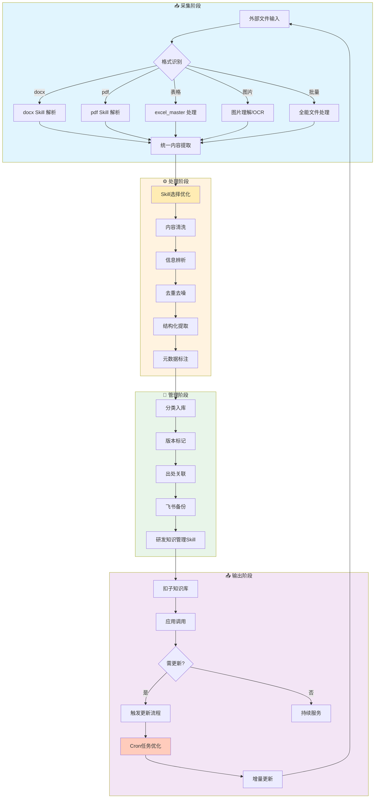

# 知识入库闭环流程文档

> **文档版本**: V1.0
> **整理时间**: 2026-04-20 14:30
> **整理者**: 扣子（主控AI）

---


## 一、概述

知识入库闭环是一套从**文件采集**到**知识输出**的完整管理流程，确保知识有出处、可追溯、能更新。

**核心原则**：
- 扣子文件为最终版，飞书为全部文件
- 支持 docx、pdf、表格、图片等多种格式
- 信息庞杂时需辨析，去重去噪

---

## 二、流程图



---

## 三、环节操作说明

### 3.1 采集阶段

#### 3.1.1 格式识别与Skill选择

| 格式 | 推荐Skill | 原因 | Token优化 | 替代方案 |
|------|---------|------|----------|---------|
| docx | docx | 标准化、稳定、功能完整 | 批量处理 | word文档助手 |
| pdf | pdf | 文本表格提取、页码信息 | 精准定位页码 | 全能文件处理技能 |
| 表格 | excel_master | 批量处理、格式保留 | 增量读取 | Excel智能自动化 |
| 图片 | 图片理解 | 识别文字、提取关键信息 | 只识别必要区域 | 全能文件处理技能 |
| 批量文件 | 全能文件处理技能 | 多格式支持、批量处理 | 一次处理多个 | 分skill处理 |

**Skill选择流程**：
1. 识别文件格式
2. 查看Skill应用场景对照表
3. 选择最优Skill（考虑Token消耗和效果）
4. 验证Skill效果
5. 记录到Skill使用日志

#### 3.1.2 操作要点
- 记录原始文件名、来源URL、采集时间
- 保留文件原始格式副本存入飞书
- 批量文件优先使用全能文件处理skill
- 关键文件用户特别标注，单独处理

### 3.2 处理阶段

#### 3.2.1 Skill选择优化

**选择原则**：
- 适用性优先：根据任务性质选择最合适的skill
- 技能组合：复杂任务可以组合多个skill
- 标准化优先：优先使用已安装的标准化skill
- 效果导向：选择能产生最好效果的skill

**选择决策树**：
```
识别任务类型
    ↓
检查已安装skill列表
    ↓
评估skill适用性
    ↓
选择最优skill或组合
    ↓
验证skill效果
    ↓
记录使用经验
```

#### 3.2.2 内容清洗
- 去除乱码、空行、页眉页脚等干扰信息
- 使用docx/pdf skill的文本提取功能
- 对比多个版本的差异，保留最新内容

#### 3.2.3 信息辨析
```
判断标准：
├── 是否与现有知识重复？
├── 信息来源是否可靠？
├── 内容时效性如何？
└── 是否需要拆分合并？
```

#### 3.2.4 结构化提取
- 标题、摘要、正文、标签、关联知识
- 使用研发知识管理skill进行结构化处理
- 提取关键信息点，便于后续调用

### 3.3 管理阶段

#### 3.3.1 Skill选择
- **飞书文档操作**：lark_cli（官方CLI、功能完整）
- **知识库构建**：研发知识管理skill
- **分类存储**：研发知识管理skill自动分类

#### 3.3.2 分类体系
```
知识库/
├── 领域分类/
│   ├── 技术文档/
│   ├── 产品手册/
│   └── 运营规范/
├── 格式分类/
│   ├── 原文件/
│   ├── 解析文本/
│   └── 结构化数据/
└── 状态分类/
    ├── 待审核/
    ├── 已入库/
    └── 需更新/
```

**版本管理**：
- v1.0 初始入库
- v1.1 小幅更新
- v2.0 重大修订

### 3.4 输出阶段

- 入库扣子知识库作为最终版
- 飞书保留全部历史版本

---

## 四、Token 消耗优化策略

### 4.1 文件处理优化

| 策略 | 说明 |
|------|------|
| **批量处理** | 同格式文件合并处理，减少工具调用 |
| **精准读取** | 使用 offset/limit 分批读取大文件 |
| **格式优先** | 优先解析结构化格式（表格 > docx > pdf > 图片） |

### 4.2 对话阶段优化

- 搜索关键词控制在 **1-6 个**
- 避免重复调用同一工具
- 简洁回复，不重复已知信息

### 4.3 模型选择

| 场景 | 推荐模型 |
|------|----------|
| 简单文档解析 | 标准模型 |
| 复杂图表理解 | 高阶模型 |
| 批量表格处理 | excel_master 专业处理 |

---

## 五、版本管理机制

### 5.1 版本命名规则

```
{知识ID}_{日期}_{版本号}

示例：TECH_001_20260115_v1.0
```

### 5.2 版本状态

| 状态 | 含义 | 操作 |
|------|------|------|
| draft | 草稿 | 待审核 |
| active | 活跃 | 当前使用 |
| deprecated | 废弃 | 历史存档 |

### 5.3 版本记录表

| 字段 | 说明 |
|------|------|
| version_id | 版本标识 |
| update_date | 更新时间 |
| update_reason | 更新原因 |
| changed_by | 更新人 |
| changes_summary | 变更摘要 |

---

## 六、出处追溯机制

### 6.1 元数据记录

每个知识条目必须包含：

```yaml
source:
  type: "url/file/email/manual"  # 来源类型
  url: "https://..."            # 来源链接
  file_path: "./原始文件/..."    # 本地路径
  collected_at: "2026-01-15"   # 采集时间
  author: "来源作者/机构"       # 作者/机构

provenance:
  raw_content: "./备份/..."     # 原始文件位置
  processed_content: "./解析/..." # 解析后内容
  confidence: 0.95              # 可信度评分
```

### 6.2 追溯查询

```
知识ID → 飞书原文件 → 原始URL → 采集时间
```

---

## 七、更新维护机制

### 7.1 更新触发条件

| 类型 | 触发条件 | 优先级 |
|------|----------|--------|
| 时效性更新 | 政策/产品/数据变化 | 高 |
| 纠错更新 | 发现错误/过时信息 | 高 |
| 补充更新 | 发现遗漏内容 | 中 |
| 优化更新 | 提升可读性/准确性 | 低 |

### 7.2 更新流程


### 7.3 定期巡检

- **周巡检**：高频更新领域（产品、运营）
- **月巡检**：中等更新频率领域
- **季巡检**：低频更新领域（规范、制度）

---

## 八、格式支持对照表

| 格式 | 读取方式 | 输出形式 | 注意事项 |
|------|----------|----------|----------|
| .docx | docx Skill | Markdown | 保留标题层级 |
| .pdf | pdf Skill | Markdown | 注意页码顺序 |
| .xlsx | excel_master | 结构化数据 | 保留公式结果 |
| .csv | excel_master | 表格 | 编码统一 UTF-8 |
| .png/.jpg | 图片理解 | 文本描述 | 优先搜索原图来源 |
| .txt | 直接读取 | 文本 | 大文件分批读取 |

---

## 九、快速参考

### 文件命名规范
```
{类型}_{日期}_{版本}.{扩展名}
示例：技术文档_20260115_v1.0.docx
```

### 目录结构
```
知识库/
├── 01_原始文件/     # 飞书备份
├── 02_解析文本/     # 处理后内容
├── 03_结构化知识/   # 入库版本
└── 04_变更记录/     # 版本日志
```

### 核心检查清单
- [ ] 原始文件已存入飞书
- [ ] 解析文本已提取
- [ ] 元数据已完整记录
- [ ] 版本号已标记
- [ ] 出处链接已关联
- [ ] 知识已入库扣子

---

*文档版本：v1.0 | 更新日期：2026-01-15*
