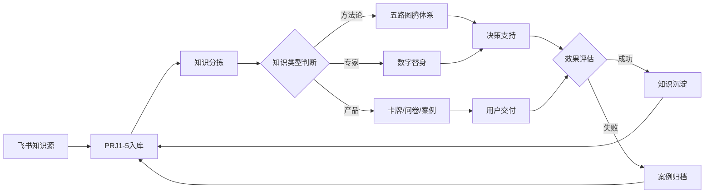

# 知识网络索引 V1.0


> **文档版本**: V1.0
> **整理时间**: 2026-04-22 12:00
> **整理者**: 扣子（主控AI）


> **版本**: V1.0  
> **编制时间**: 2026-04-22  
> **目标**: 建立知识毛细血管网络，实现知识血液化  
> **数据来源**: 全量知识资产盘点

---

## 一、知识网络架构

### 1.1 核心节点一览

| 节点层级 | 节点名称 | 类型 | 关联节点 | 激活状态 |
|:--------:|:---------|:-----|:---------|:---------|
| **L1-核心** | 满意解研究所 | 组织 | L2全部 | ✅ 激活 |
| **L2-战略** | 五路图腾体系 | 方法论 | L3.1-L3.5 | ✅ 激活 |
| **L2-战略** | 专家数字替身 | 智能系统 | L3.1-L3.6 | ⚠️ 待完善 |
| **L2-战略** | 合伙人匹配引擎 | 产品 | L3.1-L3.3 | ✅ 激活 |
| **L3-战术** | 黎红雷替身 | 专家替身 | L2.2 | ⚠️ 待建立 |
| **L3-战术** | 卡牌系列A | 游戏化交付 | L2.3 | ✅ 激活 |
| **L3-战术** | 卡牌系列B | 游戏化交付 | L2.3 | ⚠️ 待完善 |
| **L3-战术** | 问卷测评系统 | 测评工具 | L2.3 | ✅ 激活 |
| **L3-战术** | VI素材库 | 品牌资产 | L2.1 | ⚠️ 待扩充 |

---

## 二、五路图腾专家网络

### 2.1 图腾-专家映射表

| 图腾 | 五行 | 核心能力 | 决策问题 | 专家代表 | 替身状态 |
|:-----|:-----|:---------|:---------|:---------|:---------|
| 刘禹锡 | 土 | 价值纯度 | "五年后我还会觉得对吗？" | Egbertie（本体） | ✅ 自有 |
| 刘禹锡 | 土 | 价值纯度 | "五年后我还会觉得对吗？" | 谢宝剑（外援） | ✅ Python |
| 司马贺 | 金 | 理性框架 | "定个'够用就好'的线" | 罗汉教授 | ✅ Python |
| 观自在 | 水 | 压力管理 | "急眼了还能正常思考？" | 方翊沣博士 | ✅ Python |
| 孔子 | 木 | 伦理根基 | "十年后还觉得这个人对劲吗？" | 黎红雷教授 | ⚠️ 待建立 |
| 六祖慧能 | 火 | 直觉突破 | "心里那个声音，你敢不敢听？" | 李泽湘教授 | ✅ Python |

### 2.2 专家替身Python代码清单

| 文件名 | 专家 | 功能定位 | 代码行数 | 状态 |
|--------|------|----------|:---------|:-----|
| `dr_luo_han_digital_twin.py` | 罗汉教授 | 算法可行性审查、数学建模 | ~500 | ✅ |
| `dr_xie_bao_jian_digital_twin.py` | 谢宝剑研究员 | 深港政策分析、地理战略 | ~450 | ✅ |
| `dr_xu_digital_twin.py` | XU先生 | AI蓝军、压力测试设计 | ~600 | ✅ |
| `dr_chen_guo_xiang_digital_twin.py` | 陈国祥博士 | 身心能量评估、恢复协议 | ~400 | ✅ |
| `dr_fang_digital_twin.py` | 方翊沣博士 | 神经科学解码 | ~350 | ✅ |
| `dr_li_zexiang_digital_twin.py` | 李泽湘教授 | 硬科技孵化、产学研转化 | ~550 | ✅ |
| `lizexiang_human_factor_analyzer.py` | 李泽湘教授 | 人的因素分析 | ~300 | ✅ |
| `pentad_extractor.py` | 图腾系统 | 五元组提取器 | ~400 | ✅ |
| `totem_multi_agent_council.py` | 图腾系统 | 五路图腾多智能体 | ~800 | ✅ |

---

## 三、产品体系关联网络

### 3.1 产品-场景-专家三角联动

```
                    ┌──────────────────┐
                    │   合伙人类型诊断   │
                    │    (问卷测评)     │
                    └────────┬─────────┘
                             │
            ┌────────────────┼────────────────┐
            │                │                │
            ▼                ▼                ▼
    ┌──────────────┐  ┌──────────────┐  ┌──────────────┐
    │  卡牌系列A   │  │  卡牌系列B   │  │  案例库索引   │
    │  (12个Type) │  │  (6个Type)  │  │   (98份)    │
    └──────┬───────┘  └──────┬───────┘  └──────┬───────┘
           │                 │                 │
           └─────────────────┼─────────────────┘
                             │
                    ┌────────┴────────┐
                    │  专家数字替身    │
                    │   (6位专家)     │
                    └────────┬────────┘
                             │
                    ┌────────┴────────┐
                    │   五路图腾      │
                    │   决策操作系统   │
                    └─────────────────┘
```

### 3.2 卡牌与案例库映射

| 卡牌系列 | Type编号 | 主题 | 关联案例 | 专家支撑 |
|:---------|:---------|:-----|:---------|:---------|
| **A系列** | Type01 | 股权分配冲突 | 3个 | 司马贺·金 |
| **A系列** | Type02 | 控制权争夺 | 2个 | 刘禹锡·土 |
| **A系列** | Type03-12 | 其他合伙场景 | 20+ | 全部图腾 |
| **B系列** | Type01 | 合伙困境诊断 | 5个 | 观自在·水 |
| **B系列** | Type02-06 | 其他诊断类型 | 10+ | 全部图腾 |

---

## 四、知识血液化路径

### 4.1 输入→加工→输出闭环



### 4.2 知识更新频率

| 知识类型 | 更新频率 | 更新方式 | 负责人 |
|:---------|:---------|:---------|:-------|
| 五路图腾方法论 | 季度更新 | 版本迭代 | Egbertie |
| 专家数字替身 | 月度校准 | 专家评审 | 各专家 |
| 卡牌内容 | 按需更新 | 用户反馈驱动 | 产品团队 |
| 案例库 | 持续沉淀 | 新案例入库 | 运营团队 |
| VI素材 | 半年度更新 | 品牌升级驱动 | 设计团队 |

---

## 五、待完善节点清单

### 5.1 P0遗留问题

| 序号 | 问题 | 优先级 | 负责人 | 截止时间 |
|:----:|:-----|:------:|:-------|:---------|
| 1 | 黎红雷教授替身代码建立 | P1 | 技术团队 | 2026-04-30 |
| 2 | Type01文件归属确认 | P1 | Egbertie | 2026-04-22 |
| 3 | VI素材扩充（11→50） | P2 | 设计团队 | 2026-05-15 |

### 5.2 知识库完善计划

| 序号 | 任务 | 优先级 | 产出 | 状态 |
|:----:|:-----|:------:|:-----|:-----|
| 1 | 案例库索引完善 | P1 | 案例库索引.md | 待启动 |
| 2 | 专家语料库建立 | P1 | 专家金句库.md | 待启动 |
| 3 | 知识检索机制 | P2 | 检索系统设计.md | 待启动 |

---

## 六、索引文件清单

| 文件名 | 用途 | 状态 |
|:-------|:-----|:-----|
| `知识网络索引.md` | 本文件，核心节点地图 | ✅ |
| `专家数字替身清单.md` | 替身代码清单与接口 | 待生成 |
| `案例库索引.md` | 98份案例分类索引 | 待生成 |
| `协同机制设计.md` | 产品联动方案 | 待生成 |
| `资产激活清单.md` | 沉睡资产唤醒计划 | 待生成 |

---

**下一步行动**：
1. ✅ 知识网络索引已建立
2. ⏳ 等待主人决策4个事项
3. ⏳ 启动专家语料库建立
4. ⏳ 启动案例库索引完善

---

> **编制**: 满意扣子  
> **审核**: 待 Egbertie 确认  
> **版本**: V1.0
